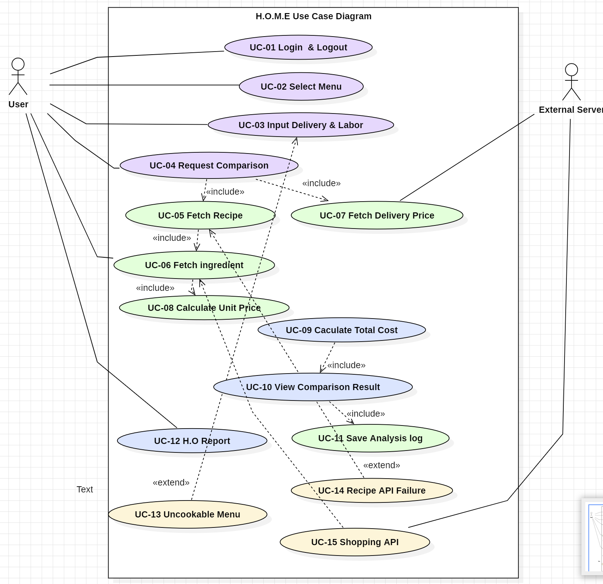
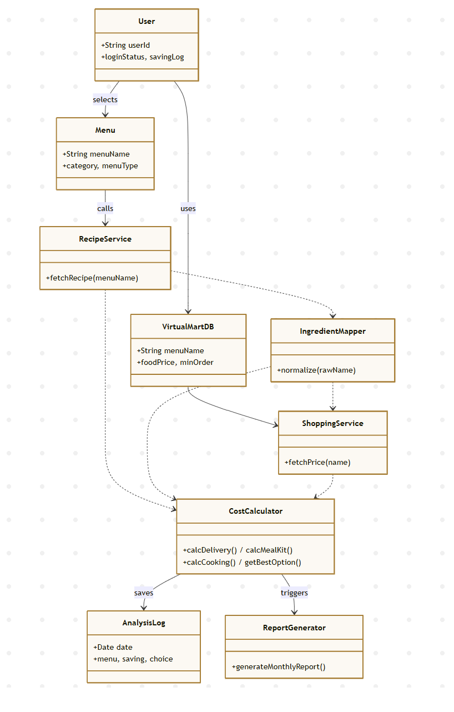

# 1. Introduction

### 1.1 문서 개요 (Executive Summary)
본 Analysis 문서는 대한민국 1인 가구 비중이 36.1%에 육박하는 인구 구조 변화 속에서, 대학생 및 자취생의 식비 부담을 체계적으로 관리하기 위한 **H.O.M.E(Hidden Opportunity Meal Economics)** 시스템의 상세 분석을 목적으로 한다. 기존의 식비 관리 방식이 단순 지출액 기록에만 머물렀다면, 본 시스템은 **기회비용(Opportunity Cost)**과 **가사 노동 비용(Labor Cost)**을 통합한 총비용 모델을 제시한다. 이를 통해 사용자는 '배달, 밀키트, 직접 조리'라는 세 가지 선택지 사이에서 자신의 시간 가치를 반영한 최적의 경제적 의사결정을 내릴 수 있다.

### 1.2 시스템의 유용성 (Usefulness)
* **실질 비용 왜곡 해소:** 프랜차이즈의 매장가 대비 높은 배달 전용 가격과 숨겨진 배달팁 구조를 가시화하여, 소비자가 표시 가격만으로 의사결정하는 비용 착시 현상을 제거한다.
* **개인 맞춤형 노동 비용 반영:** 사용자의 실제 가사 노동 시간과 설거지 도구 사용량에 따른 비용을 정량화하여, '직접 해 먹으면 무조건 싸다'는 고정관념에서 벗어난 정밀한 비교를 가능하게 한다.
* **지속 가능한 절약 동기 부여:** 'Hidden Opportunity Report' 기능을 통해 월간 누적 절약액을 시각화하고, 단순 수치가 아닌 실질적인 경제적 가치로 환산하여 장기적인 합리적 소비 습관 형성을 지원한다.

### 1.3 시스템의 중요성 및 차별성 (Significance)
* **기회비용 계수(0.2) 도입:** 조리 중 TV 시청·음악 감상 등 멀티태스킹이 가능하다는 점을 반영하여, 순수 조리 시간의 20%만 기회비용으로 산정하는 독창적인 비용 모델을 적용한다. 이는 직접 조리의 시간 비용을 과대 산정하지 않으면서도 체계적으로 반영하는 균형 잡힌 접근이다.
* **단위가격 환산 알고리즘:** 마트의 묶음 판매 단위와 레시피 필요량 간의 불일치(**Packaging Mismatch**) 문제를 해결하기 위해, 모든 재료를 실시간 최저가 기반 단위가격(`판매가 ÷ 총용량 × 사용량`)으로 환산하여 실제 끼니당 지출액만을 정확히 산출한다.
* **2026년 최저임금 기준 적용:** 시급 **10,320원**을 기준으로 시간 가치를 산정하여 분석의 현시성과 정확도를 확보하며, 사용자가 직접 수정할 수 있도록 설계하여 개인 상황에 따른 유연한 적용이 가능하다.

### 1.4 발전 및 확장성 (Expandability)
* **식재료 폐기 비용(Disposal Cost) 추적:** 유통기한 관리 기능을 추가하여 사후 발생하는 폐기 비용을 Net Saving에서 차감함으로써, 월간 절약액 산출의 정확도를 고도화할 수 있다.
* **잔여 재료 기반 메뉴 추천:** 단위가격 환산 이후 남은 재료 데이터를 누적하여, 다음 끼니 선택 시 냉장고 내 잔여 재료를 우선 활용하는 메뉴를 제안하는 방향으로 확장 가능하다. 이는 폐기 비용 절감과도 직접 연결되어 시스템의 핵심 목표를 강화한다.
* **메뉴 데이터베이스 확장:** 초기 버전에서는 카테고리별 대표 메뉴 3~5개 지원에서 시작하여, 사용자 요청 및 데이터 누적을 바탕으로 지원 메뉴를 점진적으로 확대할 수 있다. 이를 통해 더 다양한  식사 상황에서 비용 비교 분석이 가능해진다.

# 2. Use Case Analysis

---

## 2.1 Use Case Diagram

아래의 그림은 H.O.M.E 시스템의 Use Case Diagram을 나타낸 것이다.

> 

Conceptualization Document에서 정의한 Use Case List를 바탕으로 위와 같은 Diagram을 도출하였다. Use Case는 동사로 시작하도록 Naming을 하였다. Actor는 **User(자취생)** 와 **External Server** 로 총 두 개로 나타내었다. 
Actor는 User(자취생)와 External Server로 총 두 개로 나타내었다.
UC-05 ~ UC-09, UC-13 ~ UC-15는 시스템 내부 자동 처리 흐름에 해당하므로,
System은 시스템 경계(System Boundary) 내에 포함되는 내부 행위자로 간주하여
Use Case Diagram의 외부 Actor에서 제외하였다.
각 UC Description의 Actor 항목에 System을 명시한 것은
해당 UC의 실행 주체가 시스템임을 나타내기 위한 기술적 표기이며,
UML Actor와는 구분된다.
각 기능별 연관성에 따라 `«include»` 관계와 `«extend»` 관계가 적용되었다.

---

아래는 각 Use Case의 ID, Name, Actor를 정리한 표이다.

| Use Case Name | Use Case ID | Actor |
|:---|:---:|:---|
| User Login / Logout | UC-01 | User, External Server |
| Select Menu | UC-02 | User |
| Input Delivery & Labor Info | UC-03 | User |
| Request Cost Comparison | UC-04 | User |
| Fetch Recipe Data | UC-05 | System, External Server |
| Fetch Ingredient & Meal Kit Price | UC-06 | System, External Server |
| Fetch Delivery Price | UC-07 | System |
| Calculate Unit Price | UC-08 | System |
| Calculate Total Cost | UC-09 | System |
| View Comparison Result | UC-10 | User, System |
| Save Analysis Log | UC-11 | System, External Server |
| View Hidden Opportunity Report | UC-12 | User, System |
| Handle Uncookable Menu | UC-13 | System |
| Handle Recipe API Failure | UC-14 | System |
| Handle Shopping API Failure | UC-15 | System |

Use Case Description에서는 위에서부터 차례대로 각 Use Case에 대해 표로 Description을 보여줄 것이다.

---

## 2.2 Use Case Description

---

### 2.2.1 User Login / Logout

| Use Case #1 : User Login / Logout | |
|:---|:---|
| **GENERAL CHARACTERISTICS** | |
| Summary | 사용자가 계정으로 로그인하여 개인 분석 내역 및 월간 절약 로그에 접근한다. 로그아웃 시 세션이 종료된다. |
| Scope | H.O.M.E |
| Level | User level |
| Primary Actor | User |
| Secondary Actors | External Server (H.O.M.E 자체 서버 User DB —
사용자 계정 정보 및 월간 절약 로그를 저장하는 내부 데이터베이스) |
| Preconditions | 앱이 정상 실행 중인 상태 |
| Trigger | 사용자가 앱을 실행하여 로그인 화면에 진입한 경우 |
| Success Post Condition | 인증에 성공하면 개인 분석 내역 및 월간 절약 로그에 접근 가능하다. |
| Failed Post Condition | 인증에 실패하면 로그인 화면으로 복귀하고 오류 메시지를 표시한다. |

| **MAIN SUCCESS SCENARIO** | |
|:---|:---|
| Step | Action |
| 1 | 사용자가 앱을 실행하여 로그인 화면에 진입한다. |
| 2 | ID와 Password 입력란에 자신의 계정 정보를 입력한다. |
| 3 | 로그인 버튼을 누른다. |
| 4 | 시스템이 External Server의 User DB를 조회하여 계정을 인증한다. |
| 5 | 인증 성공 시 메인 화면으로 이동하고 개인 데이터에 접근한다. |

| **EXTENSION SCENARIOS** | |
|:---|:---|
| Step | Branching Action |
| 4a | 등록되지 않은 계정일 경우 — "계정을 찾을 수 없습니다" 메시지를 표시하고 입력란을 초기화한다. |
| 4b | 비밀번호가 틀린 경우 — "비밀번호가 올바르지 않습니다" 메시지를 표시하고 비밀번호 입력란만 초기화한다. |
| 4c | 네트워크 오류로 서버에 접속하지 못한 경우 — "네트워크 연결을 확인해주세요" 메시지를 표시한다. |

| **RELATED INFORMATION** | |
|:---|:---|
| Performance | ≦ 3 Seconds (로그인 버튼 클릭 후 메인 화면 진입까지) |
| Frequency | 앱 실행 시 |
| Concurrency | None |
| Due Date | 2026-06-20 |
| Etc | 비로그인 상태에서도 분석 기능은 사용 가능하나 로그는 로컬 임시 저장으로 대체된다. |

---

### 2.2.2 Select Menu

| Use Case #2 : Select Menu | |
|:---|:---|
| **GENERAL CHARACTERISTICS** | |
| Summary | 사용자가 분석을 원하는 음식 카테고리 및 메뉴를 선택한다. 선택된 메뉴의 MenuType에 따라 이후 제공되는 비교 옵션(배달/밀키트/직접 조리)이 자동으로 결정된다. |
| Scope | H.O.M.E |
| Level | User level |
| Primary Actor | User |
| Secondary Actors | System |
| Preconditions | 앱이 정상 실행 중인 상태 |
| Trigger | 사용자가 메인 화면에서 "새 분석 시작" 버튼을 누른 경우 |
| Success Post Condition | 메뉴와 MenuType이 결정되어 UC-03, UC-04 로 전달된다. |
| Failed Post Condition | None |

| **MAIN SUCCESS SCENARIO** | |
|:---|:---|
| Step | Action |
| 1 | 시스템이 카테고리 목록(한식/일식/중식/양식/프랜차이즈)을 표시한다. |
| 2 | 사용자가 카테고리를 선택한다. |
| 3 | 시스템이 해당 카테고리의 대표 메뉴 목록을 표시한다. |
| 4 | 사용자가 메뉴를 선택한다. |
| 5 | 시스템이 선택된 메뉴의 MenuType(ALL / NO_COOKING / DELIVERY_ONLY)을 확인한다. |
| 6 | MenuType에 따라 활성화할 비교 옵션을 결정하고 UC-03으로 진행한다. |

| **EXTENSION SCENARIOS** | |
|:---|:---|
| Step | Branching Action |
| 5a | MenuType이 NO_COOKING인 경우(예: 족발) — 직접 조리 옵션을 비활성화하고 배달/밀키트만 비교한다. |
| 5b | MenuType이 DELIVERY_ONLY인 경우(예: 치킨 튀김류) — 배달 옵션만 표시하고 "이 메뉴는 가정 조리가 어려워 배달 옵션만 제공됩니다" 안내 메시지를 출력한다. (UC-13 호출) |

| **RELATED INFORMATION** | |
|:---|:---|
| Performance | ≦ 2 Seconds (카테고리/메뉴 목록 표시까지) |
| Frequency | 매 분석 시작 시 |
| Concurrency | None |
| Due Date | 2026-06-20 |
| Etc | 초기 버전은 카테고리별 대표 메뉴 3~5개 지원. 이후 점진적 확장 예정. |

---

### 2.2.3 Input Delivery & Labor Info

| Use Case #3 : Input Delivery & Labor Info | |
|:---|:---|
| **GENERAL CHARACTERISTICS** | |
| Summary | 사용자가 배달팁과 가사 노동 예상 시간을 입력하여 비용 계산에 반영한다. 배달팁은 배민클럽·요기요패스 등 구독 서비스 여부에 따라 개인차가 크므로 사용자가 직접 입력하도록 설계한다. |
| Scope | H.O.M.E |
| Level | User level |
| Primary Actor | User |
| Secondary Actors | System |
| Preconditions | UC-02 완료 — 메뉴가 선택된 상태 |
| Trigger | UC-02에서 메뉴 선택 완료 후 자동 진행 |
| Success Post Condition | 배달팁, 가사 노동 시간, 도구 비용이 UC-09 총비용 계산에 전달된다. |
| Failed Post Condition | None |

| **MAIN SUCCESS SCENARIO** | |
|:---|:---|
| Step | Action |
| 1 | 시스템이 배달팁 입력 필드를 제공한다. |
| 2 | 사용자가 실제 적용받는 배달팁을 입력한다. (배민클럽 이용 시 0원 입력 가능) |
| 3 | 시스템이 가사 노동 예상 시간(분) 입력 필드를 제공한다. |
| 4 | 사용자가 설거지에 사용할 도구 종류를 선택한다. (대형 도구 200원/개, 소형 도구 100원/개) |
| 5 | 시스템이 도구 비용을 자동 합산하여 표시한다. |
| 6 | 입력 완료 후 비교 요청 버튼이 활성화된다. |

| **EXTENSION SCENARIOS** | |
|:---|:---|
| Step | Branching Action |
| 2a | 배달팁 미입력 시 — 기본값 0원으로 처리 후 계속 진행한다. |
| 3a | 가사 노동 시간 미입력 시 — 0분으로 처리하고 가사 노동 비용 = 0원으로 계산한다. |

| **RELATED INFORMATION** | |
|:---|:---|
| Performance | ≦ 1 Second (도구 비용 자동 합산 표시까지) |
| Frequency | 매 분석 시 |
| Concurrency | None |
| Due Date | 2026-06-20 |
| Etc | 도구 비용 단가: 대형 도구(냄비·프라이팬 등) 200원/개, 소형 도구(수저·집게·가위 등) 100원/개. 가사 노동 비용과 별도 항목으로 구분하여 계산한다. |

---

### 2.2.4 Request Cost Comparison

| Use Case #4 : Request Cost Comparison | |
|:---|:---|
| **GENERAL CHARACTERISTICS** | |
| Summary | 사용자가 선택한 메뉴 기준으로 배달·밀키트·직접 조리 세 옵션의 비용 비교 분석을 요청한다. 이 UC가 트리거되면 UC-05, UC-06, UC-07이 연쇄적으로 실행된다. |
| Scope | H.O.M.E |
| Level | User level |
| Primary Actor | User |
| Secondary Actors | System |
| Preconditions | UC-03 완료 — 배달팁 및 가사 노동 정보가 입력된 상태 |
| Trigger | 사용자가 "비교 분석 시작" 버튼을 누른 경우 |
| Success Post Condition | UC-05, UC-06, UC-07이 병렬/순차적으로 실행되어 데이터 수집이 시작된다. |
| Failed Post Condition | None |

| **MAIN SUCCESS SCENARIO** | |
|:---|:---|
| Step | Action |
| 1 | 사용자가 "비교 분석 시작" 버튼을 누른다. |
| 2 | 시스템이 UC-05(Fetch Recipe)와 UC-07(Fetch Delivery Price)을 동시에 트리거한다. |
| 3 | UC-05 완료 후 UC-06(Fetch Ingredient)이 순차적으로 실행된다. |
| 4 | UC-06 완료 후 UC-08(Calculate Unit Price)이 실행된다. |
| 5 | UC-07, UC-08이 모두 완료되면 UC-09(Calculate Total Cost)가 실행된다. |

| **EXTENSION SCENARIOS** | |
|:---|:---|
| Step | Branching Action |
| 1a | 사용자가 로딩 중 취소 버튼을 누른 경우 — 진행 중인 API 호출을 중단하고 메뉴 선택 화면으로 복귀한다. |
| 2a | UC-05 (Fetch Recipe) 실패 시 — UC-14(Handle Recipe API Failure) 흐름으로 분기하여 폴백 전략을 적용한다. UC-07은 독립적으로 계속 진행된다. |
| 2b | UC-06 (Fetch Ingredient & Meal Kit Price) 실패 시 — UC-15(Handle Shopping API Failure) 흐름으로 분기하여 캐시 데이터 또는 수동 입력으로 대체한다. |
| 2c | UC-07 (Fetch Delivery Price) 실패 시 — Virtual Mart DB에 해당 메뉴가 없음을 사용자에게 안내하고 수동 입력 옵션을 제공한다. |
| 5a | UC-05, UC-06, UC-07 모두 실패한 경우 — "현재 데이터를 불러올 수 없습니다. 잠시 후 다시 시도해주세요." 메시지를 표시하고 분석을 중단한다. |

| **RELATED INFORMATION** | |
|:---|:---|
| Performance | ≦ 5 Seconds (전체 데이터 수집 및 비용 계산 완료까지) |
| Frequency | 매 분석 시 |
| Concurrency | UC-05, UC-07 병렬 실행 |
| Due Date | 2026-06-20 |
| Etc | None |

---

### 2.2.5 Fetch Recipe Data

| Use Case #5 : Fetch Recipe Data | |
|:---|:---|
| **GENERAL CHARACTERISTICS** | |
| Summary | 농촌진흥청 조리식품 레시피 DB API에 메뉴명을 전달하여 재료 목록, 재료별 사용량(g/ml), 조리 시간(min)을 조회한다. |
| Scope | H.O.M.E |
| Level | Sub-function level |
| Primary Actor | System |
| Secondary Actors | External Server (농촌진흥청 Recipe API — 인증키 승인 완료, 약 1,300개 레시피 보유) |
| Preconditions | UC-04 트리거 완료 상태 |
| Trigger | UC-04 실행 후 자동 호출 |
| Success Post Condition | 재료 목록, 사용량, 조리 시간이 UC-06 및 UC-08로 전달된다. |
| Failed Post Condition | API 미등록 메뉴인 경우 UC-14 예외 처리 흐름으로 분기한다. |

| **MAIN SUCCESS SCENARIO** | |
|:---|:---|
| Step | Action |
| 1 | 시스템이 선택된 메뉴명을 농촌진흥청 API에 전달한다. |
| 2 | API가 해당 메뉴의 재료 목록, 각 재료별 사용량(g/ml), 조리 시간(min)을 반환한다. |
| 3 | 시스템이 응답 데이터를 파싱하여 재료 목록 객체를 생성한다. |
| 4 | 재료 목록과 조리 시간을 UC-06, UC-08, UC-09에 전달한다. |

| **EXTENSION SCENARIOS** | |
|:---|:---|
| Step | Branching Action |
| 2a | 해당 메뉴가 API에 미등록된 경우 — UC-14(Handle Recipe API Failure) 흐름으로 분기한다. |
| 2b | 네트워크 타임아웃 발생 시 — UC-14 흐름으로 분기한다. |

| **RELATED INFORMATION** | |
|:---|:---|
| Performance | ≦ 3 Seconds (API 호출 및 응답 완료까지) |
| Frequency | 매 비교 요청 시 |
| Concurrency | UC-07과 병렬 실행 |
| Due Date | 2026-06-20 |
| Etc | 농촌진흥청 조리식품 레시피 DB API 인증키 승인 완료 (2026-03-26). 약 1,300개 레시피 및 조리 시간 데이터 제공 확인. |

---

### 2.2.6 Fetch Ingredient & Meal Kit Price

| Use Case #6 : Fetch Ingredient & Meal Kit Price | |
|:---|:---|
| **GENERAL CHARACTERISTICS** | |
| Summary | 네이버 쇼핑 API를 통해 UC-05에서 수집한 재료 목록의 실시간 최저가 및 판매 단위(g/ml)를 조회하고, 동일 메뉴의 밀키트 판매 가격도 함께 수집한다. 식품 카테고리 필터를 적용하여 비식품 상품의 잘못된 매핑을 방지한다. |
| Scope | H.O.M.E |
| Level | Sub-function level |
| Primary Actor | System |
| Secondary Actors | External Server (Naver Shopping API) |
| Preconditions | UC-05 완료 — 재료 목록이 수집된 상태 |
| Trigger | UC-05 완료 후 자동 호출 |
| Success Post Condition | 각 재료의 최저가·판매 단위, 밀키트 가격이 UC-08, UC-09로 전달된다. |
| Failed Post Condition | API 오류 발생 시 UC-15 예외 처리 흐름으로 분기한다. |

| **MAIN SUCCESS SCENARIO** | |
|:---|:---|
| Step | Action |
| 1 | 시스템이 재료 목록에서 각 재료명을 재료명 정규화 매핑 테이블로 변환한다. |
| 2 | 변환된 검색어를 네이버 쇼핑 API에 전달하고, 식품 카테고리 필터를 함께 적용한다. |
| 3 | API가 각 재료의 실시간 최저가 및 판매 단위(g/ml)를 반환한다. |
| 4 | 동일 메뉴의 밀키트 상품을 검색하여 밀키트 판매 가격을 수집한다. |
| 5 | 수집된 가격 데이터를 UC-08, UC-09에 전달한다. |

| **EXTENSION SCENARIOS** | |
|:---|:---|
| Step | Branching Action |
| 1a | 매핑 테이블에 없는 재료명 — 원본 재료명으로 유사어 검색을 시도한다. |
| 1b | 유사어 검색에서도 결과 없음 — 해당 재료를 수동 입력 요청 목록에 추가한다. |
| 2a | 식품 카테고리 외 상품이 최저가로 검색된 경우 — 카테고리 필터로 차단하고 차순위 식품 상품을 선택한다. |
| 3a | API 호출 실패 또는 타임아웃 — UC-15 흐름으로 분기한다. |

| **RELATED INFORMATION** | |
|:---|:---|
| Performance | ≦ 4 Seconds (전체 재료 및 밀키트 가격 수집 완료까지) |
| Frequency | 매 비교 요청 시 |
| Concurrency | None (UC-05 이후 순차 실행) |
| Due Date | 2026-06-20 |
| Etc | 재료명 정규화 매핑 테이블 초기 버전: 30~50개 항목 수동 구축. |

---

### 2.2.7 Fetch Delivery Price

| Use Case #7 : Fetch Delivery Price | |
|:---|:---|
| **GENERAL CHARACTERISTICS** | |
| Summary | Virtual Mart DB에서 선택된 메뉴의 배달 가격, 최소주문금액을 조회한다. Virtual Mart DB는 배달의민족 기준으로 수동 수집한 내부 데이터베이스이며, 배달팁은 UC-03에서 사용자가 직접 입력한 값을 사용한다. |
| Scope | H.O.M.E |
| Level | Sub-function level |
| Primary Actor | System |
| Secondary Actors | Virtual Mart DB (내부 DB) |
| Preconditions | UC-04 트리거 완료 상태 |
| Trigger | UC-04 실행 후 UC-05와 병렬로 자동 호출 |
| Success Post Condition | 배달 가격과 최소주문금액이 UC-09로 전달된다. |
| Failed Post Condition | DB에 해당 메뉴 없을 경우 오류 메시지를 표시한다. |

| **MAIN SUCCESS SCENARIO** | |
|:---|:---|
| Step | Action |
| 1 | 시스템이 Virtual Mart DB에서 선택된 메뉴명으로 조회한다. |
| 2 | DB가 해당 메뉴의 배달 가격과 최소주문금액을 반환한다. |
| 3 | 수집된 데이터와 UC-03에서 입력받은 배달팁을 UC-09에 전달한다. |

| **EXTENSION SCENARIOS** | |
|:---|:---|
| Step | Branching Action |
| 2a | DB에 해당 메뉴가 없는 경우 — "해당 메뉴의 배달 가격 정보가 없습니다" 메시지를 표시하고 수동 입력 옵션을 제공한다. |

| **RELATED INFORMATION** | |
|:---|:---|
| Performance | ≦ 1 Second (로컬 DB 조회이므로 빠른 응답) |
| Frequency | 매 비교 요청 시 |
| Concurrency | UC-05와 병렬 실행 |
| Due Date | 2026-06-20 |
| Etc | Virtual Mart DB 스키마: menu_name \| food_price \| min_order \| collected_date. 배달의민족 기준 수동 수집. 수집 날짜를 함께 기록하여 데이터 신뢰도 표시. |

---

### 2.2.8 Calculate Unit Price

| Use Case #8 : Calculate Unit Price | |
|:---|:---|
| **GENERAL CHARACTERISTICS** | |
| Summary | 재료별 판매 단위와 레시피 사용량 간의 불일치(Packaging Mismatch)를 해결하기 위해, 단위가격(판매가 ÷ 총용량) 환산 방식으로 끼니당 실사용 비용을 계산한다. 간장·된장 등 조미료도 동일한 공식을 적용하여 Sunk Cost 오류를 방지한다. |
| Scope | H.O.M.E |
| Level | Sub-function level |
| Primary Actor | System |
| Secondary Actors | None |
| Preconditions | UC-06 완료 — 재료별 판매가격, 총용량, 레시피 사용량이 수집된 상태 |
| Trigger | UC-06 완료 후 자동 호출 |
| Success Post Condition | 총 식재료비가 UC-09 총비용 계산에 전달된다. |
| Failed Post Condition | None |

| **MAIN SUCCESS SCENARIO** | |
|:---|:---|
| Step | Action |
| 1 | 레시피 API에서 받은 재료 목록을 순회한다. |
| 2 | 각 재료에 대해 `단위가격 = 판매가격 ÷ 총용량(g 또는 ml)`을 계산한다. |
| 3 | `실사용 비용 = 단위가격 × 레시피 사용량`을 계산한다. |
| 4 | 모든 재료의 실사용 비용을 합산하여 총 식재료비를 반환한다. |

> **조미료 처리 원칙:** 간장·된장·참기름 등 조미료도 동일한 단위가격 공식을 적용한다. 시스템은 "냉장고가 비어있다"는 가정 하에 모든 재료를 신규 구매 기준으로 계산하여 Sunk Cost 오류를 방지한다.  
> **예)** 간장 500ml / 3,000원 → 1ml당 6원 → 레시피 사용량 15ml → 끼니당 90원

| **EXTENSION SCENARIOS** | |
|:---|:---|
| Step | Branching Action |
| 2a | 해당 재료의 쇼핑 API 가격 정보가 없는 경우 — 사용자에게 수동 가격 입력을 요청한다. |

| **RELATED INFORMATION** | |
|:---|:---|
| Performance | ≦ 1 Second (재료 목록 전체 순회 및 계산 완료까지) |
| Frequency | 매 비교 요청 시 |
| Concurrency | None |
| Due Date | 2026-06-20 |
| Etc | 핵심 공식: `ingredientCost = Σ (salePrice_i ÷ totalVolume_i) × recipeUsage_i` |

---

### 2.2.9 Calculate Total Cost

| Use Case #9 : Calculate Total Cost | |
|:---|:---|
| **GENERAL CHARACTERISTICS** | |
| Summary | 배달·밀키트·직접 조리 세 옵션의 기회비용 및 가사 노동 비용을 포함한 총비용(Total Cost)을 산출하고, 최솟값 옵션을 최적 선택으로 결정한다. 기회비용 계수 0.2는 조리 중 TV 시청·음악 감상 등 병행 활동이 가능하다는 점을 반영한 값이다. |
| Scope | H.O.M.E |
| Level | Sub-function level |
| Primary Actor | System |
| Secondary Actors | None |
| Preconditions | UC-03, UC-07, UC-08 완료 — 배달팁·배달가·식재료비·도구비가 모두 준비된 상태 |
| Trigger | UC-07, UC-08 모두 완료 이벤트 |
| Success Post Condition | 세 옵션의 Total Cost, 최적 선택, Net Saving이 UC-10과 UC-11에 전달된다. |
| Failed Post Condition | None |

| **MAIN SUCCESS SCENARIO** | |
|:---|:---|
| Step | Action |
| 1 | `배달 총비용 = 음식가격 + 사용자 입력 배달팁 + max(0, 최소주문금액 − 음식가격)` |
| 2 | `밀키트 총비용 = 제품가격 + (조리시간 ÷ 60) × 0.2 × 최저임금` |
| 3 | `직접 조리 총비용 = 식재료비 + (조리시간 ÷ 60) × 0.2 × 최저임금 + (가사노동시간 ÷ 60) × 최저임금 + 도구비용` |
| 4 | 세 값 중 최솟값을 최적 선택으로 결정한다. |
| 5 | `Net Saving = 배달 총비용 − 최적 선택 비용`을 계산한다. |
| 6 | 계산 결과를 UC-10(결과 표시) 및 UC-11(로그 저장)에 전달한다. |

| **EXTENSION SCENARIOS** | |
|:---|:---|
| Step | Branching Action |
| None | — |

| **RELATED INFORMATION** | |
|:---|:---|
| Performance | ≦ 1 Second |
| Frequency | 매 비교 요청 시 |
| Concurrency | None |
| Due Date | 2026-06-20 |
| Etc | 2026년 최저임금 기준: 시급 10,320원. 사용자 직접 수정 가능. `toolCost = Σ(largeTool × 200) + Σ(smallTool × 100)` |

---

### 2.2.10 View Comparison Result

| Use Case #10 : View Comparison Result | |
|:---|:---|
| **GENERAL CHARACTERISTICS** | |
| Summary | 배달·밀키트·직접 조리의 총비용 비교 차트, 최적 옵션 추천, 세부 비용 항목 분석 리포트를 사용자에게 표시한다. |
| Scope | H.O.M.E |
| Level | User level |
| Primary Actor | User |
| Secondary Actors | System |
| Preconditions | UC-09 완료 — 세 옵션의 Total Cost와 Net Saving이 계산된 상태 |
| Trigger | UC-09 완료 후 자동 화면 전환 |
| Success Post Condition | 사용자가 결과를 확인하고 UC-11(로그 저장)이 자동 실행된다. |
| Failed Post Condition | None |

| **MAIN SUCCESS SCENARIO** | |
|:---|:---|
| Step | Action |
| 1 | 시스템이 세 옵션의 총비용을 막대 그래프로 시각화하여 표시한다. |
| 2 | 최적 선택 옵션과 Net Saving 금액을 강조 표시한다. |
| 3 | 각 옵션의 세부 비용 항목(재료비, 기회비용, 배달팁, 도구비 등)을 상세 테이블로 표시한다. |
| 4 | 가격 데이터 조회 시점을 UI에 명시한다. (예: "2026-04-01 기준 가격") |
| 5 | UC-11(Save Analysis Log)을 자동으로 호출한다. |

| **EXTENSION SCENARIOS** | |
|:---|:---|
| Step | Branching Action |
| None | — |

| **RELATED INFORMATION** | |
|:---|:---|
| Performance | ≦ 1 Second (계산 결과 화면 렌더링까지) |
| Frequency | 매 비교 요청 완료 시 |
| Concurrency | None |
| Due Date | 2026-06-20 |
| Etc | None |

---

### 2.2.11 Save Analysis Log

| Use Case #11 : Save Analysis Log | |
|:---|:---|
| **GENERAL CHARACTERISTICS** | |
| Summary | 분석 내역(메뉴명, 세 옵션의 총비용, 사용자 선택 옵션, 절약액)을 External Server의 User DB에 저장하여 월간 Hidden Opportunity Report에 누적 반영한다. |
| Scope | H.O.M.E |
| Level | Sub-function level |
| Primary Actor | System |
| Secondary Actors | External Server (User DB) |
| Preconditions | UC-10 완료 — 사용자가 결과를 확인한 상태 |
| Trigger | UC-10 화면 표시 완료 후 자동 실행 |
| Success Post Condition | 절약 데이터가 UC-12 월간 리포트에 반영된다. |
| Failed Post Condition | 네트워크 오류 시 로컬 임시 저장 후 재시도 큐에 추가한다. |

| **MAIN SUCCESS SCENARIO** | |
|:---|:---|
| Step | Action |
| 1 | 분석 날짜, 메뉴명, 세 옵션의 총비용, 사용자 선택 옵션을 기록한다. |
| 2 | `절약액 = 배달 총비용 − 사용자 선택 옵션 비용`을 계산한다. |
| 3 | 해당 절약액을 월간 누적 절약액에 가산한다. |
| 4 | 로그 데이터를 External Server의 User DB에 저장한다. |

> **로그 구조 예시:** 날짜: 2026-04-01 / 메뉴: 제육볶음 / 선택: 직접 조리(9,800원) / 배달 기준가: 18,500원 / **절약액: 8,700원**

| **EXTENSION SCENARIOS** | |
|:---|:---|
| Step | Branching Action |
| 4a | 네트워크 오류 발생 시 — 로컬 임시 저장 후 "다음 접속 시 자동 동기화됩니다" 메시지를 표시한다. |

| **RELATED INFORMATION** | |
|:---|:---|
| Performance | ≦ 2 Seconds (서버 저장 완료까지) |
| Frequency | 매 비교 분석 완료 시 |
| Concurrency | None |
| Due Date | 2026-06-20 |
| Etc | 비로그인 상태에서는 로컬 임시 저장으로 대체. 로그인 후 자동 동기화. |

---

### 2.2.12 View Hidden Opportunity Report

| Use Case #12 : View Hidden Opportunity Report | |
|:---|:---|
| **GENERAL CHARACTERISTICS** | |
| Summary | 배달 대신 밀키트·직접 조리를 선택하여 절약한 월간 누적 금액을 시각화하고, 절약액의 실질적 활용 방안을 제안하는 동기부여 리포트를 제공한다. |
| Scope | H.O.M.E |
| Level | User level |
| Primary Actor | User |
| Secondary Actors | System, External Server (User DB) |
| Preconditions | UC-11을 통해 하나 이상의 분석 내역이 저장된 상태 |
| Trigger | 사용자가 리포트 메뉴 탭에 진입한 경우 |
| Success Post Condition | 사용자가 월간 식비 절약 성과와 의사결정 패턴을 확인한다. |
| Failed Post Condition | 저장된 로그가 없는 경우 "아직 분석 내역이 없습니다" 안내 메시지를 표시한다. |

| **MAIN SUCCESS SCENARIO** | |
|:---|:---|
| Step | Action |
| 1 | 시스템이 서버에서 해당 사용자의 월간 분석 로그를 조회한다. |
| 2 | 배달 대신 밀키트·직접 조리를 선택한 횟수와 누적 절약 금액을 집계한다. |
| 3 | 누적 절약액을 막대 차트 또는 원형 차트로 시각화하여 표시한다. |
| 4 | 절약액의 대안 활용 제안 메시지를 함께 표시한다. |

> **제안 메시지 예시:** "이번 달 절약한 58,000원으로 OTT 구독 3개월치를 낼 수 있어요!"

| **EXTENSION SCENARIOS** | |
|:---|:---|
| Step | Branching Action |
| 1a | 네트워크 오류 시 — 로컬 캐시 데이터로 리포트를 생성하고 "최근 저장 데이터 기준" 안내를 표시한다. |

| **RELATED INFORMATION** | |
|:---|:---|
| Performance | ≦ 3 Seconds (서버 조회 및 리포트 렌더링까지) |
| Frequency | 사용자가 리포트 탭 진입 시 |
| Concurrency | None |
| Due Date | 2026-06-20 |
| Etc | None |

---

### 2.2.13 Handle Uncookable Menu

| Use Case #13 : Handle Uncookable Menu | |
|:---|:---|
| **GENERAL CHARACTERISTICS** | |
| Summary | 가정 조리가 불가능한 메뉴에 대해 MenuType 플래그를 확인하여 제공 옵션을 제한한다. 조리 불가 기준은 가정용 조리 환경에서 재현 불가능하거나 조리 시간이 2시간을 초과하는 메뉴이다. |
| Scope | H.O.M.E |
| Level | Sub-function level |
| Primary Actor | System |
| Secondary Actors | None |
| Preconditions | UC-02에서 사용자가 메뉴를 선택한 상태 |
| Trigger | UC-02에서 선택된 메뉴의 MenuType 확인 시 |
| Success Post Condition | 사용자가 메뉴 타입에 맞는 옵션만 확인한다. |
| Failed Post Condition | None |

| **MenuType 분류** | |
|:---|:---|
| `ALL` | 배달·밀키트·직접 조리 모두 가능 |
| `NO_COOKING` | 배달·밀키트만 가능 (예: 족발 — 밀키트 제품 존재) |
| `DELIVERY_ONLY` | 배달만 가능 (예: 치킨 튀김류 — 전문 장비 필요) |

| **MAIN SUCCESS SCENARIO** | |
|:---|:---|
| Step | Action |
| 1 | 시스템이 선택된 메뉴의 MenuType을 확인한다. |
| 2 | `NO_COOKING`이면 직접 조리 옵션을 비활성화하고 배달·밀키트만 표시한다. |
| 3 | `DELIVERY_ONLY`이면 밀키트·직접 조리를 모두 비활성화하고 "이 메뉴는 가정 조리가 어려워 배달 옵션만 제공됩니다" 메시지를 출력한다. |

| **RELATED INFORMATION** | |
|:---|:---|
| Performance | ≦ 0.5 Seconds |
| Frequency | UC-02 실행 시마다 |
| Concurrency | None |
| Due Date | 2026-06-20 |
| Etc | None |

---

### 2.2.14 Handle Recipe API Failure

| Use Case #14 : Handle Recipe API Failure | |
|:---|:---|
| **GENERAL CHARACTERISTICS** | |
| Summary | 농촌진흥청 레시피 API에 해당 메뉴가 미등록되었거나 API 호출이 실패한 경우, 3단계 폴백 전략을 적용하여 분석 흐름이 중단되지 않도록 한다. |
| Scope | H.O.M.E |
| Level | Sub-function level |
| Primary Actor | System |
| Secondary Actors | None |
| Preconditions | UC-05 실행 중 API 응답에 해당 메뉴 없음 또는 오류 발생 |
| Trigger | 레시피 API 응답 실패 이벤트 |
| Success Post Condition | 폴백 전략으로 조리 시간이 확보되어 분석 흐름이 유지된다. |
| Failed Post Condition | 3순위 폴백까지 실패 시 오류 메시지를 표시한다. |

| **조리 시간 3단계 폴백 전략** | |
|:---|:---|
| 1순위 | 레시피 API 반환값 사용 |
| 2순위 | 사용자 직접 입력 |
| 3순위 | 카테고리별 평균 상수 자동 적용 |

| **카테고리별 기본 조리 시간** | | |
|:---:|:---:|:---:|
| 카테고리 | 직접 조리 | 밀키트 |
| 한식 | 35분 | 20분 |
| 일식 | 25분 | 15분 |
| 중식 | 30분 | 15분 |
| 양식 | 30분 | 20분 |
| 프랜차이즈 | — (배달 전용) | 10분 |

| **MAIN SUCCESS SCENARIO** | |
|:---|:---|
| Step | Action |
| 1 | API 응답에 해당 메뉴가 없음을 감지한다. |
| 2 | 사용자에게 조리 시간 직접 입력 옵션을 제공한다. |
| 3 | 사용자가 미입력 시 해당 카테고리 평균 상수를 자동 적용한다. |
| 4 | 재료 목록이 없는 경우 사용자에게 수동 입력을 요청하거나 유사 메뉴 데이터를 참조한다. |

| **RELATED INFORMATION** | |
|:---|:---|
| Performance | ≦ 3 Seconds (폴백 처리 완료까지) |
| Frequency | API 미등록 메뉴 선택 시 |
| Concurrency | None |
| Due Date | 2026-06-20 |
| Etc | None |

---

### 2.2.15 Handle Shopping API Failure

| Use Case #15 : Handle Shopping API Failure | |
|:---|:---|
| **GENERAL CHARACTERISTICS** | |
| Summary | 네이버 쇼핑 API 호출이 실패하거나 특정 재료의 검색 결과가 없는 경우, 로컬 캐시 데이터로 대체하거나 수동 입력을 요청하여 분석 흐름이 중단되지 않도록 한다. |
| Scope | H.O.M.E |
| Level | Sub-function level |
| Primary Actor | System |
| Secondary Actors | None |
| Preconditions | UC-06 실행 중 Naver Shopping API 응답 오류 발생 |
| Trigger | HTTP 오류, 타임아웃, 빈 응답 등 |
| Success Post Condition | 오류 상황에서도 분석 흐름이 유지된다. |
| Failed Post Condition | 캐시도 없고 수동 입력도 거부 시 해당 재료를 비용 계산에서 제외하고 경고를 표시한다. |

| **MAIN SUCCESS SCENARIO** | |
|:---|:---|
| Step | Action |
| 1 | 시스템이 오류 유형(네트워크 오류 / 검색 결과 없음)을 판별한다. |
| 2 | 로컬 캐시에 최근 데이터가 존재하면 캐시 데이터를 사용하고 UI에 "최근 저장 데이터 기준" 안내를 표시한다. |
| 3 | 캐시가 없는 경우 해당 재료의 수동 가격 입력을 요청한다. |

| **EXTENSION SCENARIOS** | |
|:---|:---|
| Step | Branching Action |
| 3a | 사용자가 수동 입력을 거부한 경우 — 해당 재료를 비용 계산에서 제외하고 결과 화면에 "일부 재료 가격 미포함" 경고를 표시한다. |

| **RELATED INFORMATION** | |
|:---|:---|
| Performance | ≦ 2 Seconds (폴백 처리 완료까지) |
| Frequency | API 오류 발생 시 |
| Concurrency | None |
| Due Date | 2026-06-20 |
| Etc | None |

# 3. Domain Analysis

---

아래의 그림은 H.O.M.E 시스템의 Domain Analysis에서 도출된 핵심 클래스들의 관계를 나타낸 것이다.

H.O.M.E 시스템은 크게 **사용자 및 메뉴 관리**, **외부 데이터 수집**, **비용 계산**, **결과 기록 및 리포트** 네 가지 역할 그룹으로 클래스를 분류할 수 있다. 각 클래스의 역할과 관계는 다음과 같다.

---

## 3.1 클래스 설명

---

### 1) User

사용자의 계정 정보와 로그인 상태, 월간 절약 로그를 관리하는 클래스이다.
사용자는 `Menu` 클래스를 통해 분석할 메뉴를 선택하고, `VirtualMartDB`를 통해 배달 가격 정보를 조회하는 흐름의 시작점이 된다.

**주요 속성 및 메서드:**

| 구분 | 이름 | 설명 |
|:---:|:---|:---|
| 속성 | `userId` | 사용자 고유 식별자 |
| 속성 | `loginStatus` | 로그인 상태 (true / false) |
| 속성 | `savingLog` | 누적 절약 로그 목록 (`AnalysisLog` 참조) |
| 메서드 | `login()` | 계정 인증 및 세션 시작 |
| 메서드 | `logout()` | 세션 종료 |
| 메서드 | `viewReport()` | 월간 Hidden Opportunity Report 조회 요청 |

---

### 2) Menu

분석 대상 메뉴의 이름, 카테고리, 조리 가능 여부를 관리하는 클래스이다.
`menuType` 속성을 통해 배달·밀키트·직접 조리 세 옵션 중 어떤 옵션을 사용자에게 제공할지 결정한다.

**주요 속성 및 메서드:**

| 구분 | 이름 | 설명 |
|:---:|:---|:---|
| 속성 | `menuName` | 메뉴 이름 (예: 제육볶음) |
| 속성 | `category` | 음식 카테고리 (한식 / 일식 / 중식 / 양식 / 프랜차이즈) |
| 속성 | `menuType` | 조리 가능 여부 (`ALL` / `NO_COOKING` / `DELIVERY_ONLY`) |
| 메서드 | `getAvailableOptions()` | menuType에 따라 활성화할 옵션 목록 반환 |

**MenuType 분류 기준:**

| MenuType | 설명 | 예시 |
|:---:|:---|:---|
| `ALL` | 배달·밀키트·직접 조리 모두 가능 | 제육볶음, 된장찌개 |
| `NO_COOKING` | 배달·밀키트만 가능 | 족발 (밀키트 제품 존재) |
| `DELIVERY_ONLY` | 배달만 가능 | 치킨 튀김류 (전문 장비 필요) |

---

### 3) VirtualMartDB

배달의민족 기준으로 수동 수집한 배달 가격 데이터베이스 클래스이다.
메뉴명으로 조회하면 배달 음식 가격과 최소주문금액을 반환한다. 배달팁은 사용자가 UC-03에서 직접 입력하므로 본 클래스에는 포함되지 않는다.
수집 날짜(`collectedDate`)를 함께 기록하여 UI에서 데이터 신뢰도를 표시하는 데 활용한다.

**주요 속성 및 메서드:**

| 구분 | 이름 | 설명 |
|:---:|:---|:---|
| 속성 | `menuName` | 메뉴 이름 |
| 속성 | `foodPrice` | 배달 음식 가격 (원) |
| 속성 | `minOrder` | 최소주문금액 (원) |
| 속성 | `collectedDate` | 데이터 수집 날짜 |
| 메서드 | `lookup(menuName)` | 메뉴명으로 배달 가격 정보 조회 |

**DB 예시:**

| menu_name | food_price | min_order | collected_date |
|:---:|:---:|:---:|:---:|
| 제육볶음 | 9,000원 | 12,000원 | 2026-04-01 |
| 된장찌개 | 8,000원 | 10,000원 | 2026-04-01 |

---

### 4) RecipeService

농촌진흥청 조리식품 레시피 DB API를 호출하여 선택된 메뉴의 재료 목록, 재료별 사용량(g/ml), 조리 시간(min)을 반환하는 클래스이다.
API 미등록 메뉴 발생 시 폴백 전략(사용자 입력 → 카테고리 평균 상수)을 적용한다.

> 농촌진흥청 조리식품 레시피 DB API 인증키 승인 완료 (2026-03-26). 약 1,300개 레시피 및 조리 시간 데이터 제공 확인.

**주요 속성 및 메서드:**

| 구분 | 이름 | 설명 |
|:---:|:---|:---|
| 속성 | `apiKey` | 농촌진흥청 API 인증키 |
| 속성 | `fallbackTimeMap` | 카테고리별 평균 조리 시간 상수 테이블 |
| 메서드 | `fetchRecipe(menuName)` | 메뉴명으로 레시피 데이터 조회 및 반환 |
| 메서드 | `applyFallback(category)` | API 미등록 시 카테고리 평균 상수 반환 |

**카테고리별 기본 조리 시간 상수 (`fallbackTimeMap`):**

| 카테고리 | 직접 조리 | 밀키트 |
|:---:|:---:|:---:|
| 한식 | 35분 | 20분 |
| 일식 | 25분 | 15분 |
| 중식 | 30분 | 15분 |
| 양식 | 30분 | 20분 |
| 프랜차이즈 | — | 10분 |

---

### 5) Ingredient

`RecipeService`와 `ShoppingService` 사이를 연결하는 **DTO(Data Transfer Object)** 역할의 클래스이다.
레시피 API에서 반환된 재료 목록과 네이버 쇼핑 API에서 조회한 가격 데이터를 하나의 객체로 통합하여
`CostCalculator`의 단위가격 환산 계산에 전달한다.

**주요 속성 및 메서드:**

| 구분 | 이름 | 타입 | 설명 |
|:---:|:---|:---:|:---|
| 속성 | `ingredientName` | String | 재료명 (레시피 API 반환) |
| 속성 | `salePrice` | int | 판매 가격 (쇼핑 API 반환, 원) |
| 속성 | `totalVolume` | float | 판매 총용량 (쇼핑 API 반환, g 또는 ml) |
| 속성 | `recipeUsage` | float | 레시피 필요 사용량 (레시피 API 반환, g 또는 ml) |
| 속성 | `unitPrice` | float | 단위가격 — 계산값 (`salePrice ÷ totalVolume`) |
| 속성 | `actualCost` | float | 실사용 비용 — 계산값 (`unitPrice × recipeUsage`) |
| 메서드 | `calcUnitPrice()` | void | `salePrice ÷ totalVolume` 을 계산하여 `unitPrice` 에 저장 |
| 메서드 | `calcActualCost()` | void | `unitPrice × recipeUsage` 를 계산하여 `actualCost` 에 저장 |

**데이터 흐름 예시:**

| ingredientName | salePrice | totalVolume | recipeUsage | unitPrice | actualCost |
|:---:|:---:|:---:|:---:|:---:|:---:|
| 돼지고기 앞다리 | 8,000원 | 500g | 200g | 16원/g | 3,200원 |
| 진간장 | 3,000원 | 500ml | 15ml | 6원/ml | 90원 |
| 참기름 | 6,000원 | 160ml | 5ml | 37.5원/ml | 187원 |

> `RecipeService`가 재료 목록을 `List<Ingredient>` 형태로 반환하고,
> `ShoppingService`가 각 `Ingredient` 객체의 `salePrice`, `totalVolume`을 채운 뒤,
> `CostCalculator`가 `calcUnitPrice()`, `calcActualCost()`를 호출하여 최종 식재료비를 산출한다.

---

### 6) ShoppingService

네이버 쇼핑 API를 통해 식재료의 실시간 최저가와 판매 단위(g/ml), 밀키트 판매 가격을 수집하는 클래스이다.
식품 카테고리 필터를 적용하여 비식품 상품(씨앗, 화분 등)이 최저가로 잘못 매핑되는 오류를 방지한다.

**주요 속성 및 메서드:**

| 구분 | 이름 | 설명 |
|:---:|:---|:---|
| 속성 | `apiKey` | 네이버 쇼핑 API 인증키 |
| 속성 | `categoryFilter` | 식품 카테고리 코드 (비식품 매핑 차단) |
| 메서드 | `fetchPrice(ingredientName)` | 재료명으로 최저가 및 판매 단위 조회 |
| 메서드 | `fetchMealKitPrice(menuName)` | 메뉴명으로 밀키트 판매 가격 조회 |

---

### 7) IngredientMapper

농촌진흥청 레시피 API의 재료명과 네이버 쇼핑 API 검색어 간의 불일치를 보정하는 내부 매핑 테이블 클래스이다.
초기 버전에서는 30~50개 항목을 수동으로 구축하며, 매핑 실패 시 유사어 검색 후 수동 입력 폴백을 적용한다.

**주요 속성 및 메서드:**

| 구분 | 이름 | 설명 |
|:---:|:---|:---|
| 속성 | `mappingTable` | 레시피 재료명 → 쇼핑 검색어 매핑 딕셔너리 |
| 메서드 | `normalize(rawName)` | 원본 재료명을 쇼핑 검색어로 변환 |
| 메서드 | `addMapping(rawName, searchTerm)` | 새 매핑 항목 추가 |

**매핑 테이블 예시:**

| 레시피 재료명 (rawName) | 쇼핑 검색어 (searchTerm) |
|:---|:---|
| 대파 | 대파 1단 |
| 돼지앞다리살 | 돼지고기 앞다리 |
| 참기름 | 참기름 식용 |
| 간장 | 진간장 |

---

### 8) CostCalculator

H.O.M.E 시스템의 핵심 계산 클래스이다.
`RecipeService`, `ShoppingService`, `VirtualMartDB`로부터 수집한 데이터를 바탕으로 배달·밀키트·직접 조리 세 옵션의 총비용을 산출하고, 최적 선택과 Net Saving을 반환한다.

**주요 속성 및 메서드:**

| 구분 | 이름 | 설명 |
|:---:|:---|:---|
| 속성 | `minWage` | 최저임금 시급 (기본값: 10,320원, 사용자 수정 가능) |
| 메서드 | `calcDelivery(foodPrice, deliveryFee, minOrder)` | 배달 총비용 산출 |
| 메서드 | `calcMealKit(kitPrice, cookMin)` | 밀키트 총비용 산출 |
| 메서드 | `calcCooking(ingredientCost, cookMin, laborMin, toolCost)` | 직접 조리 총비용 산출 |
| 메서드 | `getBestOption()` | 최솟값 옵션 및 Net Saving 반환 |
| 메서드 | `calcUnitPrice(salePrice, totalVolume, usage)` | 재료 단위가격 환산 |

**핵심 비용 공식:**

| 옵션 | 공식 |
|:---:|:---|
| 배달 | `foodPrice + deliveryFee + max(0, minOrder − foodPrice)` |
| 밀키트 | `kitPrice + (cookMin ÷ 60) × 0.2 × minWage` |
| 직접 조리 | `Σ(salePrice_i ÷ totalVol_i × usage_i) + (cookMin ÷ 60) × 0.2 × minWage + (laborMin ÷ 60) × minWage + toolCost` |
| 단위가격 | `salePrice ÷ totalVolume` |
| Net Saving | `배달 총비용 − min(배달, 밀키트, 직접 조리)` |

---

### 9) AnalysisLog

매 분석 완료 시 생성되는 절약 로그 클래스이다.
분석 날짜, 메뉴명, 사용자 선택 옵션, 배달 기준가 대비 절약액을 저장하며, 월간 리포트 집계의 원천 데이터로 활용된다.

**주요 속성 및 메서드:**

| 구분 | 이름 | 설명 |
|:---:|:---|:---|
| 속성 | `date` | 분석 날짜 (YYYY-MM-DD) |
| 속성 | `menuName` | 분석 메뉴명 |
| 속성 | `chosenOption` | 사용자가 선택한 옵션 (배달 / 밀키트 / 직접 조리) |
| 속성 | `deliveryBaseCost` | 배달 기준 총비용 |
| 속성 | `actualCost` | 실제 선택 옵션의 총비용 |
| 속성 | `saving` | 절약액 (`deliveryBaseCost − actualCost`) |
| 메서드 | `save()` | 서버 User DB에 로그 저장 |

**로그 구조 예시:**

| date | menuName | chosenOption | deliveryBaseCost | actualCost | saving |
|:---:|:---:|:---:|:---:|:---:|:---:|
| 2026-04-01 | 제육볶음 | 직접 조리 | 18,500원 | 9,800원 | 8,700원 |

---

### 10) ReportGenerator

`AnalysisLog` 데이터를 집계하여 월간 Hidden Opportunity Report를 생성하는 클래스이다.
누적 절약액을 시각화하고, 절약액의 실질적 활용 방안을 제안하는 동기부여 메시지를 함께 생성한다.

**주요 속성 및 메서드:**

| 구분 | 이름 | 설명 |
|:---:|:---|:---|
| 속성 | `targetMonth` | 리포트 대상 월 |
| 메서드 | `generateMonthlyReport(userId, month)` | 월간 절약 리포트 생성 |
| 메서드 | `calcMonthlySaving(logs)` | 월간 누적 절약액 집계 |
| 메서드 | `getSuggestionMessage(totalSaving)` | 절약액 기반 활용 제안 메시지 생성 |

**제안 메시지 생성 예시:**

| 누적 절약액 | 제안 메시지 |
|:---:|:---|
| 58,000원 | "이번 달 절약한 58,000원으로 OTT 구독 3개월치를 낼 수 있어요!" |
| 30,000원 | "이번 달 절약한 30,000원으로 카페 라떼 15잔을 마실 수 있어요!" |

---

## 3.2 클래스 관계 요약

| 관계 | 클래스 A | 관계 유형 | 클래스 B | 설명 |
|:---:|:---:|:---:|:---:|:---|
| 1 | `User` | association | `Menu` | 사용자가 메뉴를 선택한다 |
| 2 | `Menu` | dependency | `RecipeService` | 메뉴 선택 후 레시피 API 호출 |
| 3 | `Menu` | dependency | `CostCalculator` | 메뉴 정보(조리시간, MenuType)가 비용 계산에 전달된다 |
| 4 | `VirtualMartDB` | dependency | `CostCalculator` | 배달 가격 데이터가 비용 계산에 전달된다 |
| 5 | `RecipeService` | association | `IngredientMapper` | 레시피 재료명을 쇼핑 검색어로 정규화 |
| 6 | `RecipeService` | creates | `Ingredient` | 레시피 API 응답으로 Ingredient 객체 목록 생성 |
| 7 | `IngredientMapper` | association | `ShoppingService` | 정규화된 검색어로 쇼핑 API 호출 |
| 8 | `ShoppingService` | fills | `Ingredient` | 각 Ingredient의 salePrice, totalVolume 값을 채움 |
| 9 | `Ingredient` | dependency | `CostCalculator` | 단위가격 환산 후 실사용 비용을 CostCalculator에 전달 |
| 10 | `CostCalculator` | association | `AnalysisLog` | 계산 결과를 로그로 저장한다 |
| 11 | `CostCalculator` | dependency | `ReportGenerator` | 로그 저장 후 리포트 생성을 트리거한다 |

