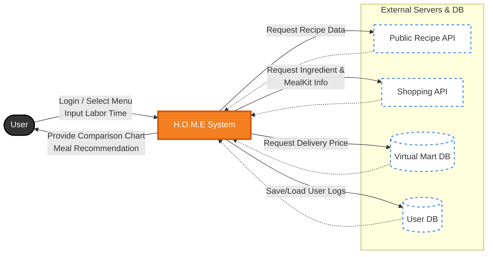

# H.O.M.E — Conceptualization Report
### Hidden Opportunity Meal Economics

> **Student ID:** 22212042 | **Name:** 김민범 | **E-mail:** 7557191@naver.com

---

## Contents

1. [Business Purpose](#1-business-purpose)
2. [System Context Diagram](#2-system-context-diagram)
3. [Use Case List](#3-use-case-list)
4. [Concept of Operation](#4-concept-of-operation)
5. [Problem Statement](#5-problem-statement)
6. [Glossary](#6-glossary)
7. [Reference](#7-reference)

---

## 1. Business Purpose

### 1.1 1인 가구의 인구 구조 변화와 식비 부담 실태

2024년 기준 대한민국 1인 가구의 비중은 **36.1%** 에 달하며, 이는 지속적으로 증가하는 추세입니다.
식비는 1인 가구에게 가장 큰 경제적 부담 요소 중 하나로, 다인 가구에 비해 식재료 대량 구매가 어렵고 조리 효율이 낮은 특성상 배달 서비스에 대한 의존도가 필연적으로 높게 나타납니다.

| 가계수지항목별 | 2023 전체 (원) | 2024 전체 (원) | 2025 전체 (원) |
|:---:|:---:|:---:|:---:|
| 01. 식료품·비주류음료 | 216,130 | 230,056 | 238,451 |
| 11. 음식·숙박 | 292,768 | 306,756 | 312,736 |

통계청 가계동향조사에 따르면, '음식·숙박' 지출은 2023년 대비 2025년에 **6.82%**, '식료품·비주류음료' 지출은 **10.33%** 증가하였습니다.
이는 단순 조리 또한 고물가의 영향을 피할 수 없음을 보여주며, 단순 가격 비교를 넘어선 **기회비용(Opportunity Cost) 중심의 합리적 의사결정**이 절실한 시점입니다.

---

### 1.2 배달 서비스의 구조적 문제

과거 최소 주문 금액(평균 15,000원)이 1인 가구의 배달 이용을 가로막는 주요 장벽이었습니다.
최근 배달 플랫폼들이 이러한 니즈를 반영하여 한 그릇 배달 서비스를 경쟁적으로 출시하며, 겉으로 보기에는 진입 장벽이 낮아진 것처럼 보입니다.

그러나 그 이면에는 새로운 구조적 문제가 자리잡고 있습니다.

- 주요 패스트푸드·카페·치킨·피자 프랜차이즈들이 **배달 전용 가격을 매장가보다 높게 설정**하여 운영
- 배달팁(평균 2,000 ~ 4,000원) 및 최소주문금액 규정이 실질 지출을 음식 가격 이상으로 끌어올림
- 소비자는 이러한 구조를 인지하지 못한 채 **겉으로 보이는 가격만으로 의사결정**을 내림

이는 단순히 "배달이 비싸다"는 감각적 인식의 문제가 아니라, **비용 왜곡**입니다.

---

### 1.3 프로젝트 목표: H.O.M.E (Hidden Opportunity Meal Economics)

본 프로젝트는 **대학생과 1인 가구 직장인**을 주요 타겟으로 하여, 배달, 밀키트, 직접 조리라는 세 가지 선택지를 **기회비용 기반 총비용 모델**로 통합 분석합니다.

특히 근로자 가구의 외식 지출이 비근로자 대비 약 **1.77배** 높다는 점에 주목하여, 사용자가 식비 구조를 직관적으로 이해하고 불필요한 지출 누수를 막을 수 있는 **실질적인 식사 의사결정 지원 시스템**을 구축하고자 합니다.

궁극적으로 H.O.M.E은 단순한 가격 비교 도구를 넘어, **1인 가구의 지속 가능한 삶을 위한 합리적인 Meal Economics 모델**을 제시하는 데 그 목적이 있습니다.

#### 타겟 시장

| 구분 | 대상 |
|:---:|:---|
 **Main** | 식비 부담은 크지만 요리가 막막한 2030 자취생 |
| **Sub** | 배달 음식의 높은 가격에 피로감을 느껴 건강한 가성비를 찾는 1인 가구 |

---

## 2. System Context Diagram



### User → System

| 데이터 흐름 | 설명 |
|:---|:---|
| **Login / Logout** | 사용자 계정 인증. 로그인 시 개인 분석 내역 및 월간 절약 로그 접근 가능 |
| **Select Menu** | 분석할 음식 카테고리(한식·일식·중식·양식·프랜차이즈) 및 메뉴 선택 |
| **Input Labor Time** | 설거지 등 가사 노동 예상 시간 입력. 최저임금 기준 노동 비용 산출에 사용 |
| **Request Cost Comparison** | 선택한 메뉴 기준으로 배달·밀키트·직접 조리 세 옵션의 비용 비교 분석 요청 |

### System → User

| 데이터 흐름 | 설명 |
|:---|:---|
| **Comparison Chart** | 배달·밀키트·직접 조리의 총비용과 소요 시간을 시각적 그래프로 제공 |
| **Choice Recommendation** | 가격·시간·노동 비용을 종합 고려하여 가장 유리한 식사 방식 추천 |
| **Price/Time Analysis** | 각 옵션별 세부 비용 항목(재료비, 기회비용, 배달팁 등)과 소요 시간 분석 제공 |

### System → External Server

| 데이터 흐름 | 설명 |
|:---|:---|
| **Request Recipe** | 농촌진흥청 공공 레시피 API에 메뉴명을 전달하여 재료 목록, 사용량(g/ml), 조리 시간 요청 |
| **Request Ingredient & Meal Kit Info** | 네이버 쇼핑 API(식품 카테고리 필터 적용)로 식재료 실시간 최저가 및 밀키트 판매 가격 요청 |
| **Save User Logs** | 분석 내역, 선택 옵션, 배달 기준가 대비 절약액을 사용자 DB에 저장 |

### External Server → System

| 데이터 흐름 | 설명 |
|:---|:---|
| **Provide Recipe** | 해당 메뉴의 재료 목록, 재료별 필요 용량(g/ml), 조리 시간(min) 반환 |
| **Provide Ingredient & Meal Kit Data** | 식재료별 실시간 최저가, 판매 단위(g/ml), 밀키트 가격 및 조리 시간 반환 |
| **Provide Delivery Price** | Virtual Mart DB에서 해당 메뉴의 배달 가격, 배달팁, 최소주문금액 반환 |
| **Response Result** | 로그인 처리 결과, 데이터 저장 완료 등 서버 처리 응답 반환 |

---

## 3. Use Case List

### 3.1 Use Case Overview

| UC-ID | Name | Description | Actor | Trigger |
|:---:|:---|:---|:---:|:---:|
| UC-01 | User Login / Logout | 사용자가 계정으로 로그인하여 개인 분석 내역 및 절약 로그를 관리한다 | User, Server | 앱 실행 시 |
| UC-02 | Select Menu | 분석할 음식 카테고리 및 메뉴를 선택한다 | User | 메뉴 선택 화면 |
| UC-03 | Input Delivery & Labor Info | 배달팁과 가사 노동 예상 시간을 입력하여 비용 계산에 반영한다 | User | 비교 요청 전 |
| UC-04 | Request Cost Comparison | 선택한 메뉴 기준으로 세 옵션의 비용 비교를 요청한다 | User | 비교 요청 버튼 |
| UC-05 | Fetch Recipe Data | 공공 레시피 API에서 재료 목록, 사용량, 조리 시간을 조회한다 | System, Server | UC-04 트리거 후 |
| UC-06 | Fetch Ingredient & Meal Kit Price | 네이버 쇼핑 API로 식재료 최저가와 밀키트 가격을 조회한다 | System, Server | UC-05 완료 후 |
| UC-07 | Fetch Delivery Price | Virtual Mart DB에서 배달 가격, 최소주문금액을 조회한다 | System | UC-04 트리거 후 (UC-05와 병렬) |
| UC-08 | Calculate Unit Price | 재료별 판매 단위와 레시피 사용량을 환산하여 실사용 비용을 계산한다 | System | UC-06 완료 후 |
| UC-09 | Calculate Total Cost | 세 옵션의 기회비용 포함 총비용을 산출하고 최적 선택을 결정한다 | System | UC-07, UC-08 모두 완료 후 |
| UC-10 | View Comparison Result | 비용 비교 차트, 추천 옵션, 세부 분석 리포트를 표시한다 | User, System | UC-09 완료 후 |
| UC-11 | Save Analysis Log | 분석 내역, 선택 옵션, 절약액을 서버에 저장한다 | System, Server | UC-10 표시 후 |
| UC-12 | View Hidden Opportunity Report | 월간 누적 절약 로그와 대안 활용 제안을 리포트로 제공한다 | User, System | 리포트 메뉴 진입 시 |
| UC-13 | Handle Uncookable Menu | 가정 조리가 불가능한 메뉴에 대해 메뉴 타입에 따라 옵션을 제한한다 | System | UC-02에서 해당 메뉴 선택 시 |
| UC-14 | Handle Recipe API Failure | 레시피 API 미등록 메뉴 발생 시 조리 시간 폴백 전략을 적용한다 | System | API 응답에 해당 메뉴 없을 시 |
| UC-15 | Handle Shopping API Failure | 쇼핑 API 오류 발생 시 캐시 데이터로 대체하거나 수동 입력을 안내한다 | System | API 응답 오류 발생 시 |

### 3.2 UC 의존 관계 (Dependency Tree)

```
UC-04 (비교 요청)
 ├── UC-05 (레시피 조회)
 │       └── UC-06 (재료 가격 조회)
 │               └── UC-08 (단위가격 환산)
 │                       └── UC-09 (총비용 산출) ◄─┐
 └── UC-07 (배달 가격 조회) ────────────────────────┘
         ↓
     UC-10 (결과 표시)
         └── UC-11 (로그 저장)

예외 처리 (병렬 감시)
 ├── UC-13 (조리 불가 메뉴) ← UC-02 선택 시점
 ├── UC-14 (레시피 API 실패) ← UC-05 실행 중
 └── UC-15 (쇼핑 API 실패) ← UC-06 실행 중
```

---

### 3.3 Use Case Description (핵심 UC 상세)

#### ▶ UC-03: Input Delivery & Labor Info

| 항목 | 내용 |
|:---|:---|
| **Use Case ID** | UC-03 |
| **Name** | Input Delivery & Labor Info (배달팁 및 가사 노동 정보 입력) |
| **Actor** | User |
| **Precondition** | UC-02 완료 — 메뉴가 선택된 상태 |
| **Trigger** | 비교 요청 전 입력 단계 |
| **Main Flow** | 1. 시스템이 배달팁 입력 필드를 제공한다<br>2. 사용자가 실제 적용받는 배달팁을 직접 입력한다<br>&nbsp;&nbsp;&nbsp;&nbsp;(배민클럽·요기요패스 등 구독 서비스 이용 시 0원 입력 가능)<br>3. 시스템이 가사 노동 예상 시간(분) 입력 필드를 제공한다<br>4. 사용자가 설거지에 사용할 도구 종류를 선택한다<br>5. 시스템이 도구 비용을 자동 계산하여 표시한다 |
| **배달팁 처리 원칙** | 배달팁은 구독 서비스 여부에 따라 사용자마다 상이하므로 시스템이 임의로 설정하지 않고 **사용자가 직접 입력**한다. 기본값은 0원이며, 미입력 시 0원으로 처리된다 |
| **Postcondition** | 배달팁, 가사 노동 시간, 도구 비용이 UC-09 총비용 계산에 전달된다 |

---

#### ▶ UC-08: Calculate Unit Price

| 항목 | 내용 |
|:---|:---|
| **Use Case ID** | UC-08 |
| **Name** | Calculate Unit Price (재료 단위가격 환산) |
| **Actor** | System |
| **Precondition** | UC-06 완료 — 재료별 판매가격, 총용량, 레시피 사용량이 수집된 상태 |
| **Trigger** | 식재료 가격 데이터 수집 완료 이벤트 |
| **Main Flow** | 1. 레시피 API에서 받은 재료 목록을 순회한다<br>2. 각 재료에 대해 `단위가격 = 판매가격 ÷ 총용량(g 또는 ml)`을 계산한다<br>3. `실사용 비용 = 단위가격 × 레시피 사용량`을 계산한다<br>4. 재료명 정규화 매핑 테이블을 참조하여 API 검색어 불일치를 보정한다<br>5. 모든 재료의 실사용 비용을 합산하여 총 식재료비를 반환한다 |
| **Alternative Flow** | 4a. 매핑 테이블에 없는 재료명 → 유사어 검색 후 식품 카테고리 내 최저가 상품 선택<br>4b. 검색 결과 없음 → 사용자에게 수동 가격 입력 요청 |
| **Postcondition** | 총 식재료비가 UC-09 총비용 계산에 전달된다 |
| **핵심 공식** | `ingredientCost = Σ (salePrice_i ÷ totalVolume_i) × recipeUsage_i` |

> **조미료 처리 원칙:** 간장·된장·참기름 등 조미료도 동일한 단위가격 공식을 적용한다.
> 시스템은 "냉장고가 비어있다"는 가정 하에 모든 재료를 신규 구매 기준으로 계산하여 Sunk Cost 오류를 방지한다.
> 예) 간장 500ml / 3,000원 → 1ml당 6원 → 레시피 사용량 15ml → 90원

---

#### ▶ UC-09: Calculate Total Cost

| 항목 | 내용 |
|:---|:---|
| **Use Case ID** | UC-09 |
| **Name** | Calculate Total Cost (기회비용 포함 총비용 산출) |
| **Actor** | System |
| **Precondition** | UC-03, UC-07, UC-08 완료 — 배달팁·배달가·식재료비·도구비가 모두 준비된 상태 |
| **Trigger** | UC-07, UC-08 모두 완료 이벤트 |
| **Main Flow** | 1. `배달 총비용 = 음식가격 + 사용자 입력 배달팁 + max(0, 최소주문금액 − 음식가격)`<br>2. `밀키트 총비용 = 제품가격 + (조리시간 ÷ 60) × 0.2 × 최저임금`<br>3. `직접 조리 총비용 = 식재료비 + (조리시간 ÷ 60) × 0.2 × 최저임금 + (가사노동시간 ÷ 60) × 최저임금 + 도구 비용`<br>4. 세 값 중 최솟값을 최적 선택으로 결정한다<br>5. `Net Saving = 배달 총비용 − 최적 선택 비용`을 계산한다 |
| **도구 비용 계산** | 냄비·프라이팬 등 대형 도구: 개당 **200원** / 수저·집게·가위 등 소형 도구: 개당 **100원**<br>사용자가 사용한 도구를 선택하면 시스템이 자동 합산 |
| **Postcondition** | 세 옵션의 Total Cost, 최적 선택, Net Saving이 UC-10과 UC-11에 전달된다 |
| **기회비용 계수 근거** | 조리는 TV 시청·음악 감상 등 다른 활동과 병행 가능하므로 순수 기회비용의 20%만 반영 |

---

#### ▶ UC-11: Save Analysis Log

| 항목 | 내용 |
|:---|:---|
| **Use Case ID** | UC-11 |
| **Name** | Save Analysis Log (절약 로그 저장) |
| **Actor** | System, Server |
| **Precondition** | UC-10 완료 — 사용자가 결과를 확인한 상태 |
| **Trigger** | 결과 화면 표시 완료 이벤트 |
| **Main Flow** | 1. 분석 날짜, 메뉴명, 세 옵션의 총비용, 사용자 선택 옵션을 기록한다<br>2. `절약액 = 배달 총비용 − 사용자 선택 옵션 비용`을 계산한다<br>3. 해당 절약액을 월간 누적 절약액에 가산한다<br>4. 로그 데이터를 서버 User DB에 저장한다 |
| **로그 구조 예시** | 날짜: 2026-03-25 / 메뉴: 제육볶음 / 선택: 직접 조리(9,800원) / 배달 기준가: 18,500원 / **절약액: 8,700원** |
| **Postcondition** | 절약 데이터가 UC-12 월간 리포트에 반영된다 |

---

#### ▶ UC-13: Handle Uncookable Menu

| 항목 | 내용 |
|:---|:---|
| **Use Case ID** | UC-13 |
| **Name** | Handle Uncookable Menu (조리 불가 메뉴 처리) |
| **Actor** | System |
| **Precondition** | UC-02에서 사용자가 메뉴를 선택한 상태 |
| **Trigger** | 선택된 메뉴의 MenuType 확인 |
| **메뉴 타입 분류** | `ALL`: 배달·밀키트·직접 조리 모두 가능<br>`NO_COOKING`: 배달·밀키트만 가능 (예: 족발 — 밀키트 제품 존재)<br>`DELIVERY_ONLY`: 배달만 가능 (예: 치킨 튀김류 — 전문 장비 필요) |
| **조리 불가 기준** | 가정용 조리 환경에서 재현 불가능하거나 조리 시간이 2시간을 초과하는 메뉴 |
| **Main Flow** | 1. 선택된 메뉴의 MenuType을 확인한다<br>2. `NO_COOKING`이면 직접 조리 옵션을 비활성화하고 배달·밀키트만 표시한다<br>3. `DELIVERY_ONLY`이면 밀키트·직접 조리 옵션을 모두 비활성화하고 안내 메시지를 출력한다 |
| **Postcondition** | 사용자가 메뉴 타입에 맞는 옵션만 확인한다 |

---

#### ▶ UC-14: Handle Recipe API Failure

| 항목 | 내용 |
|:---|:---|
| **Use Case ID** | UC-14 |
| **Name** | Handle Recipe API Failure (레시피 API 미등록 메뉴 처리) |
| **Actor** | System |
| **Precondition** | UC-05 실행 중 해당 메뉴가 농촌진흥청 API에 미등록된 상태 |
| **Trigger** | 레시피 API 응답에 해당 메뉴 없음 |
| **조리 시간 폴백 전략** | 1순위: 레시피 API 반환값 사용<br>2순위: 사용자 직접 입력<br>3순위: 카테고리별 평균 상수 자동 적용 |
| **카테고리별 평균 조리 시간** | 한식 35분 / 일식 25분 / 중식 30분 / 양식 30분 / 밀키트 공통 20분 |
| **Main Flow** | 1. API 응답에 해당 메뉴가 없음을 감지한다<br>2. 사용자에게 조리 시간 직접 입력 옵션을 제공한다<br>3. 사용자가 입력하지 않으면 해당 카테고리 평균 상수를 자동 적용한다<br>4. 재료 목록은 사용자가 직접 입력하거나 유사 메뉴 데이터를 참조한다 |
| **Postcondition** | 레시피 API 미등록 메뉴에서도 분석 흐름이 유지된다 |

---

#### ▶ UC-15: Handle Shopping API Failure

| 항목 | 내용 |
|:---|:---|
| **Use Case ID** | UC-15 |
| **Name** | Handle Shopping API Failure (쇼핑 API 오류 처리) |
| **Actor** | System |
| **Precondition** | UC-06 실행 중 네이버 쇼핑 API 응답 오류 발생 |
| **Trigger** | HTTP 오류, 타임아웃, 빈 응답 등 |
| **Main Flow** | 1. 오류 유형(네트워크 오류 / 검색 결과 없음)을 판별한다<br>2. 로컬 캐시에 최근 데이터가 존재하면 캐시 데이터를 사용하고 UI에 *"최근 저장 데이터 기준"* 을 표시한다<br>3. 캐시도 없는 경우 해당 재료의 수동 가격 입력을 요청한다 |
| **Postcondition** | 오류 상황에서도 분석 흐름이 유지되거나 명확한 안내 메시지가 출력된다 |

---

## 4. Concept of Operation

### 4.1 System Overview

H.O.M.E은 사용자의 식사 선택 행동을 데이터 기반으로 최적화하는 **Meal Economics 플랫폼**이다.
시스템은 단순한 가격 비교를 넘어 기회비용, 가사 노동 비용, 재료 단위 환산 등 숨겨진 비용 요소를 통합적으로 분석하여 가장 경제적인 식사 방식을 제안한다.

시스템의 운영 흐름은 크게 **4단계**로 구성된다.

```
① 사용자 입력  →  ② 외부 데이터 조회  →  ③ 총비용 산출  →  ④ 결과 표시 및 기록
```

---

### 4.2 Operational Flow (운영 절차)

#### ① 사용자 입력 단계 (User Input Phase)

- 사용자가 음식 카테고리 → 메뉴를 순서대로 선택한다
- 선택한 메뉴의 MenuType에 따라 사용 가능한 옵션이 자동으로 결정된다
- **배달팁을 직접 입력한다.** 배민클럽·요기요패스 등 구독 서비스 이용자는 0원 입력 가능하며, 미입력 시 기본값 0원으로 처리된다
- 직접 조리 옵션이 활성화된 경우, 가사 노동 예상 시간(설거지 등)과 사용할 도구를 선택한다
- 조리 시간은 레시피 API 반환값을 우선 적용하며, 없을 경우 사용자 입력 → 카테고리 평균 상수 순으로 폴백된다

#### ② 외부 데이터 수집 단계 (Data Collection Phase)

아래 세 가지 데이터 소스가 병렬 또는 순차적으로 조회된다.

| 데이터 소스 | 제공 데이터 | 조회 방식 |
|:---:|:---|:---:|
| 농촌진흥청 레시피 API | 재료 목록, 사용량(g/ml), 조리 시간(min) | UC-05 |
| 네이버 쇼핑 API | 식재료 실시간 최저가, 판매 단위, 밀키트 가격 | UC-06 (UC-05 이후) |
| Virtual Mart DB | 배달 가격, 최소주문금액 | UC-07 (UC-05와 병렬) |

- 네이버 쇼핑 API는 **식품 카테고리 필터**를 적용하여 비식품 상품이 최저가로 매핑되는 오류를 방지한다
- 재료명 정규화 매핑 테이블로 API 검색어 불일치를 자동 보정한다 (초기 버전: 수동 구축 30~50개 항목)

#### ③ 총비용 산출 단계 (Cost Calculation Phase)

| 옵션 | 비용 공식 |
|:---:|:---|
| **배달** | `foodPrice + userInputDeliveryFee + max(0, minOrder − foodPrice)` |
| **밀키트** | `kitPrice + (cookMin ÷ 60) × 0.2 × minWage` |
| **직접 조리** | `Σ(salePrice_i ÷ totalVol_i × usage_i) + (cookMin ÷ 60) × 0.2 × minWage + (laborMin ÷ 60) × minWage + toolCost` |

**도구 비용(toolCost) 산출 기준:**

| 도구 종류 | 단가 | 예시 |
|:---:|:---:|:---:|
| 대형 도구 | 200원 / 개 | 냄비, 프라이팬, 찜기 등 |
| 소형 도구 | 100원 / 개 | 수저, 집게, 가위, 뒤집개 등 |

- 세 옵션의 총비용을 비교하여 최솟값 옵션을 최적 선택으로 결정한다
- `Net Saving = 배달 총비용 − 최적 선택 비용`을 산출한다

#### ④ 결과 제공 및 기록 단계 (Output & Logging Phase)

- 비용 비교 차트, 최적 옵션 추천, 세부 가격 분석 결과를 사용자에게 표시한다
- 분석 내역과 절약액을 서버에 저장하여 월간 Hidden Opportunity Report에 누적 반영한다

---

### 4.3 Key Design Principles (핵심 설계 원칙)

| 원칙 | 설명 |
|:---|:---|
| **기회비용 통합** | 조리 시간을 최저임금 기준으로 환산하여 총비용에 포함. 조리는 다른 활동과 병행 가능하므로 계수 0.2 적용 |
| **배달팁 사용자 직접 입력** | 배민클럽·요기요패스 등 구독 서비스에 따라 배달팁이 상이하므로 시스템이 임의로 설정하지 않고 사용자가 직접 입력. 기본값 0원 |
| **도구 비용 정량화** | 설거지에 사용하는 도구를 대형(200원/개)·소형(100원/개)으로 분류하여 가사 노동 비용에 포함 |
| **단위가격 환산** | 묶음 판매 단위와 레시피 사용량 간 불일치를 `단위가격 = 판매가 ÷ 총용량`으로 해결. 조미료 포함 전 재료에 일관 적용 |
| **냉장고 비어있음 가정** | 모든 재료를 신규 구매 기준으로 계산. 기존 재고를 Sunk Cost로 보는 인지 오류를 방지 |
| **조리 불가 메뉴 분리** | MenuType 플래그(ALL / NO_COOKING / DELIVERY_ONLY)로 메뉴별 제공 옵션을 명확히 제한 |
| **조리 시간 폴백 전략** | API 반환값 → 사용자 입력 → 카테고리 평균 상수 순으로 폴백하여 미등록 메뉴에서도 분석 가능 |
| **맛·선호도 범위 외** | 경제적 최적화에 집중하며, 맛·기호 등 주관적 요소는 사용자 판단 영역으로 설계 범위 외로 설정 |
| **데이터 신뢰도 명시** | 가격 데이터는 조회 시점 기준임을 UI에 표시. Virtual Mart DB는 수집 날짜를 함께 기록 |

---

### 4.4 User Scenario (사용자 시나리오)

대학생 A는 저녁으로 제육볶음을 먹을지 고민한다.

1. H.O.M.E 앱에서 "제육볶음"을 선택한다
2. 배달팁을 **0원**으로 입력한다 (배민클럽 구독 중)
3. 설거지 예상 시간 **10분**, 사용 도구로 **프라이팬(200원)·수저(100원)** 를 선택한다
4. 시스템이 배달, 밀키트, 직접 조리 비용을 계산한다

| 옵션 | 총비용 |
|:---:|:---|
| 배달 | 14,000원 (배달팁 0원 적용) |
| 밀키트 | 13,200원 |
| **직접 조리** | **9,800원** ✅ |

5. 시스템은 "직접 조리"를 최적 선택으로 추천한다
6. 사용자는 해당 선택으로 약 **4,200원**을 절약한다

이 데이터는 월간 절약 리포트에 누적된다.

---

### 4.5 System Constraints (시스템 제약 조건)

- **최저임금 기준:** 2026년 대한민국 최저임금 시급 **10,320원** 기본 적용. 사용자 직접 수정 가능
- **배달팁:** 사용자 직접 입력. 기본값 0원. 미입력 시 0원으로 처리
- **도구 비용 단가:** 대형 도구 200원/개, 소형 도구 100원/개. 초기 버전 고정값으로 설정
- **메뉴 범위:** 초기 버전은 카테고리별 대표 메뉴 3~5개 지원. 이후 확장 예정
- **Virtual Mart DB:** 배달의민족 기준 수동 수집. 메뉴별 음식 가격, 최소주문금액 포함. 수집 날짜 기록
- **레시피 매핑 테이블:** 초기 버전 30~50개 수동 등록. 매핑 실패 시 유사어 검색 → 수동 입력 폴백
- **로그인 연동:** 분석 로그는 계정과 연동하여 서버 저장. 비로그인 시 로컬 임시 저장

---

## 5. Problem Statement

### 5.1 Problem Definition (문제 정의)

대한민국 1인 가구의 식사 의사결정은 표면적으로 단순한 선택처럼 보이지만, 실질적으로는 **다차원 비용 최적화 문제**다. 현재 소비자가 직면한 핵심 문제는 다음과 같다.

---

#### ① 시간 비용(기회비용)의 체계적 누락

직접 조리에 소요되는 평균 30~40분은 2025년 최저임금(10,030원) 기준으로 약 **5,015원**에 해당하는 경제적 가치를 지닌다.
그러나 현재 존재하는 어떤 식비 비교 도구도 이 시간 비용을 체계적으로 반영하지 않는다.
본 시스템은 조리가 다른 활동과 병행 가능하다는 점을 반영하여 **계수 0.2**를 적용, 시간 가치의 20%를 기회비용으로 산정한다.

---

#### ② 가사 노동 비용의 비가시성

직접 조리 후 발생하는 설거지·주방 정리 등 가사 노동은 실질적인 시간을 소모하지만 기존 식비 계산에서 완전히 배제된다.
이는 직접 조리의 총비용을 **구조적으로 과소평가**하게 만드는 원인이다.
본 시스템은 가사 노동 시간을 사용자에게 직접 입력받아 최저임금 기준 전액을 비용으로 산정하며, 사용한 도구(대형 200원/개, 소형 100원/개)의 비용도 함께 반영한다.

---

#### ③ 재료 단위 불일치로 인한 비용 왜곡 (Packaging Mismatch)

레시피는 재료를 gram 단위로 요구하지만, 마트에서는 묶음(1팩, 1봉지) 단위로만 판매된다.

```
예시: 레시피 돼지고기 200g 필요
     마트 판매 단위: 500g / 8,000원
     단순 판매가 적용 시 → 8,000원 (과대 계상)
     단위가격 환산 적용 시 → 8,000 ÷ 500 × 200 = 3,200원 (실사용 비용)
```

**단순 판매 가격으로 비교하면 직접 조리 비용이 실제보다 2~3배 과대 계상**되는 문제가 발생한다.
본 시스템은 `단위가격 = 판매가 ÷ 총용량` 공식으로 모든 재료의 실사용 비용만 산정한다.

---

#### ④ 조미료 끼니당 실사용 비용 산출 어려움

간장·된장·참기름 등 조미료는 대용량으로 구매하여 장기간 소량씩 사용한다.
끼니당 실제 사용 비용을 산출하지 않으면 조미료 비용이 0원으로 처리되어 **직접 조리 비용이 실제보다 낮게 왜곡**된다.

```
예시: 간장 500ml / 3,000원
     1ml당 단위가격 = 6원
     레시피 사용량 15ml → 끼니당 90원
```

본 시스템은 조미료도 동일한 단위가격 공식을 적용하며, "냉장고가 비어있다"는 가정으로 일관성을 유지한다.

---

#### ⑤ 레시피 API ↔ 쇼핑 API 재료명 불일치

공공 레시피 API의 재료명("대파", "돼지앞다리살")이 네이버 쇼핑 검색어와 정확히 일치하지 않는 경우가 빈번하다.
또한 쇼핑 API 검색 시 식품이 아닌 상품(씨앗, 화분 등)이 최저가로 매핑될 수 있다.

본 시스템은 두 가지 방식으로 이 문제를 해결한다.
- **재료명 정규화 매핑 테이블:** API 재료명과 쇼핑 검색어를 수동으로 매핑한 내부 테이블 (초기 버전 30~50개 항목)
- **식품 카테고리 필터:** 네이버 쇼핑 API 호출 시 식품 카테고리로 검색 범위를 제한

---

#### ⑥ 식약처 레시피 API 미등록 메뉴 처리

식약처 공공 레시피 API는 대다수 메뉴(약 1300개)를 포함하지만, **일부 메뉴는 등록되지 않은 경우**가 존재한다.
이 경우 조리 시간과 재료 목록을 자동으로 가져올 수 없어 분석 흐름이 중단될 위험이 있다.

본 시스템은 다음의 **3단계 전략**으로 이 문제를 해결한다.

| 순위 | 전략 | 적용 조건 |
|:---:|:---:|:---:|
| 1순위 | 레시피 API 반환값 사용 | API에 해당 메뉴 등록된 경우 |
| 2순위 | 사용자 직접 입력 | API 미등록, 사용자가 직접 입력 선택 시 |
| 3순위 | 카테고리별 평균 상수 자동 적용 | API 미등록 + 사용자 미입력 시 |

**카테고리별 기본 조리 시간 상수:**
|:---:|:---:|:---:|
| 카테고리 | 직접 조리 | 밀키트 |

| 한식 | 35분 | 20분 |
| 일식 | 25분 | 15분 |
| 중식 | 30분 | 15분 |
| 양식 | 30분 | 20분 |
| 프랜차이즈 | — (배달 전용) | 10분 |

---

#### ⑦ 식재료 폐기 비용의 사후 미추적

1인 가구는 대용량으로 판매되는 식재료를 소량만 사용하고 나머지를 유통기한 초과로 폐기하는 경우가 빈번하다.
이 폐기 비용은 의사결정 시점에서는 예측이 어려우므로 **Sunk Cost 원칙에 따라 실시간 비교에서는 제외**한다.
단, 월간 Hidden Opportunity Report에서는 누적 폐기 비용을 Net Saving에서 차감하여 **월 별 절약액의 정확도를 높인다**.

---

#### ⑧ 배달팁의 개인별 편차

배달 플랫폼의 구독 서비스(배달의민족 배민클럽, 요기요 요기패스 등) 이용 여부에 따라 동일한 주문에서도 배달팁이 0원에서 수천 원까지 상이하게 적용된다.
시스템이 평균값을 임의로 설정하면 구독 이용자에게는 비용이 과대 계상되고, 비구독 이용자에게는 과소 계상되는 왜곡이 발생한다.

본 시스템은 **배달팁을 사용자가 직접 입력**하도록 설계하여 이 편차를 해결한다.
기본값은 0원으로 설정하며, 사용자가 실제 적용받는 배달팁을 입력하면 해당 값이 배달 총비용 계산에 반영된다.

---

### 5.2 H.O.M.E의 해결 방식 요약

> 식재료의 실제 비용 산출에는 세 가지 구조적 어려움이 존재한다.
> 첫째, 마트의 묶음 판매 단위와 레시피 사용량 간의 불일치로 단순 가격 비교가 불가능하다.
> 둘째, 간장·된장 등 조미료는 소량씩 장기 사용되어 끼니당 실사용 비용 산출이 어렵다.
> 셋째, 공공 레시피 API의 재료명과 쇼핑 API 상품명이 일치하지 않아 자동 매핑 로직이 필요하다.
>
> H.O.M.E은 **`단위가격 환산(판매가 ÷ 총용량 × 사용량)`** 방식과 **재료명 정규화 매핑 테이블**,
> 그리고 **3단계 조리 시간 선택 전략**을 통해 이 문제들을 해결한다.

---

### 5.3 Problem Formalization (문제의 형식화)

**목적함수:**

$$\text{minimize} \{ \text{Total\_Delivery},\ \text{Total\_MealKit},\ \text{Total\_Cooking} \}$$

| 변수 | 공식 |
|:---:|:---:|
| **Total_Delivery** | `foodPrice + userInputDeliveryFee + max(0, minOrder − foodPrice)` |
| **Total_MealKit** | `kitPrice + (cookMin ÷ 60) × 0.2 × minWage` |
| **Total_Cooking** | `Σ(salePrice_i ÷ totalVol_i × usage_i) + (cookMin ÷ 60) × 0.2 × minWage + (laborMin ÷ 60) × minWage + toolCost` |
| **toolCost** | `Σ(largeTool × 200) + Σ(smallTool × 100)` |
| **unitPrice_i** | `salePrice_i ÷ totalVolume_i` (네이버 쇼핑 API 실시간 조회) |
| **Net Saving** | `Total_Delivery − min(Total_Delivery, Total_MealKit, Total_Cooking)` |
| **Disposal Cost** | 의사결정 시 Sunk Cost로 제외 → 월간 리포트에서만 Net Saving에서 차감 |

---

### 5.4 예외 처리 설계 (Exception Handling Design)

| 예외 상황 | 처리 방식 |
|:---:|:---:|
| **재료 묶음 단위 불일치** | `단위가격 = 판매가 ÷ 총용량`으로 환산 후 사용량만큼 비례 계산 |
| **조미료 비용 산출** | 동일한 단위가격 공식 적용. "냉장고 비어있음" 가정으로 일관성 유지 |
| **소포장 미존재 재료** | 판매 최소 단위 가격 기준 계산 + UI에 "소포장 없음" 태그 표시 |
| **재료명 매핑 실패** | 매핑 테이블 참조 → 유사어 검색 → 수동 입력 요청 순으로 폴백 |
| **레시피 API 미등록 메뉴** | API값 → 사용자 입력 → 카테고리 평균 상수 순으로 폴백 |
| **쇼핑 API 오류** | 로컬 캐시 데이터로 대체 + 조회 시점 명시. 캐시 없으면 수동 입력 안내 |
| **쇼핑 API 비식품 매핑** | 식품 카테고리 필터 적용으로 비식품 상품 매핑 차단 |
| **배달팁 미입력** | 기본값 0원으로 처리 |
| **조리 불가 메뉴** | MenuType(ALL / NO_COOKING / DELIVERY_ONLY) 플래그로 옵션 제한 |
| **계절·지역별 가격 변동** | API 응답값 그대로 사용 + UI에 "조회 시점 기준 가격" 명시 |

---

### 5.5 As-Is vs. To-Be

| 구분 | As-Is (현재 문제) | To-Be (H.O.M.E 해결 후) |
|:---:|:---:|:---:|
| **비용 비교** | 음식 표시 가격만 단순 비교 | 기회비용·노동비용 포함 총비용 비교 |
| **시간 비용** | 완전 무시 | 최저임금 × 계수 0.2로 환산하여 포함 |
| **재료 단위** | 묶음 가격 그대로 사용 | 단위가격 환산으로 실사용 비용만 계산 |
| **조미료 비용** | 0원 처리 (이미 있으니까) | 단위가격 × 사용량으로 끼니당 비용 산출 |
| **배달팁** | 평균값 고정 또는 미반영 | 사용자 직접 입력 (구독 서비스 반영 가능) |
| **도구 비용** | 미반영 | 대형 200원·소형 100원 기준 자동 합산 |
| **미등록 메뉴** | 분석 불가 | 3단계 폴백 전략으로 분석 흐름 유지 |
| **폐기 비용** | 추적 불가 | 월간 리포트에서 Net Saving에 차감 반영 |
| **의사결정 근거** | 직관 또는 습관 | 실시간 데이터 기반 정량적 추천 |
| **절약 동기** | 없음 | 월간 누적 절약 로그 시각화 + 활용 제안 |

---

### 5.6 기존 서비스의 한계 (Limitations of Existing Services)

현재 배달 플랫폼(배달의민족 등)과 레시피 플랫폼은 각각 가격 정보 또는 조리 정보를 제공하지만,
다음과 같은 한계가 존재한다.

| 서비스 유형 | 제공 정보 | 한계 |
|:---:|:---:|:---:|
| 배달 플랫폼 | 음식 가격, 배달팁 | 총비용 구조 분석 불가. 기회비용·노동비용 미반영 |
| 레시피 플랫폼 | 조리 방법, 재료 목록 | 경제성 판단 기능 없음. 가격 정보 미제공 |
| 가격 비교 서비스 | 식재료 단순 가격 | 단위가격 환산 및 기회비용 미반영 |

따라서 세 가지 선택지(배달·밀키트·직접 조리)를 하나의 비용 모델로 통합 분석하는 시스템은 현재 존재하지 않는다.
H.O.M.E은 이 공백을 채우는 것을 목표로 한다.

---

## 6. Glossary

| Term | Definition |
|:---:|:---:|
| **H.O.M.E** | Hidden Opportunity Meal Economics의 약자. 배달·밀키트·직접 조리의 숨겨진 비용을 분석하여 1인 가구의 식사 경제학을 최적화하는 본 프로젝트 명칭 |
| **Total Cost (총비용)** | 식사 한 끼에 소요되는 모든 비용의 합. 음식 가격, 배달팁, 기회비용, 가사 노동 비용, 도구 비용을 포함하며 단순 음식 가격과 구별됨 |
| **Opportunity Cost (기회비용)** | 조리 시간을 최저임금 기준으로 환산한 경제적 가치. 조리는 다른 활동과 병행 가능하므로 계수 0.2 적용. `(조리시간 ÷ 60) × 0.2 × 최저임금` |
| **Labor Cost (가사 노동 비용)** | 설거지·주방 정리 등 조리 후 가사 노동 시간을 최저임금으로 환산한 비용. 기회비용 계수 없이 전액 반영. `(노동시간 ÷ 60) × 최저임금` |
| **Tool Cost (도구 비용)** | 설거지 시 사용하는 도구의 사용 비용. 냄비·프라이팬 등 대형 도구 200원/개, 수저·집게·가위 등 소형 도구 100원/개 |
| **Unit Price (단위가격)** | 식재료의 단위 용량당 가격. `단위가격 = 전체 판매가격 ÷ 총 용량`. 예) 된장 500g / 4,800원 → 1g당 9.6원 |
| **Packaging Mismatch** | 레시피 요구 용량(g)과 마트 판매 단위(묶음) 간의 불일치. 단위가격 환산으로 해결 |
| **냉장고 비어있음 가정** | 모든 재료를 신규 구매 기준으로 계산하는 시스템 원칙. 기존 재고를 비용으로 보는 Sunk Cost 오류를 방지 |
| **MenuType** | 메뉴의 조리 가능 여부를 나타내는 분류. ALL(모두 가능) / NO_COOKING(배달+밀키트만) / DELIVERY_ONLY(배달만) |
| **Net Saving (순 절약액)** | 배달 기준가 대비 실제 선택 옵션의 비용 차액. `Net Saving = 배달 총비용 − 선택 옵션 비용`. 월간 리포트에서는 폐기 비용 추가 차감 |
| **Disposal Cost (폐기 비용)** | 유통기한 초과로 폐기된 식재료의 구매 비용. 의사결정 시 Sunk Cost로 제외, 월간 리포트에서만 반영 |
| **Sunk Cost (매몰 비용)** | 이미 지출되어 회수 불가능한 비용. 냉장고에 이미 있는 식재료 비용이 해당. 합리적 의사결정을 위해 비용 계산에서 제외 |
| **Virtual Mart DB** | 배달의민족 기준으로 수동 수집한 내부 배달 가격 데이터베이스. 음식 가격, 최소주문금액, 수집 날짜 포함 |
| **재료명 정규화 매핑 테이블** | 공공 레시피 API 재료명과 네이버 쇼핑 검색어 간 불일치를 보정하는 내부 매핑 테이블. 초기 버전 30~50개 항목 수동 구축 |
| **조리 시간 3단계 전략** | 레시피 API 미등록 메뉴 발생 시 적용. 1순위: API 반환값 / 2순위: 사용자 입력 / 3순위: 카테고리 평균 상수 |
| **Hidden Opportunity Report** | 배달 대신 밀키트·직접 조리를 선택하여 절약한 누적 금액을 월 단위로 시각화하고 활용 방안을 제안하는 동기부여 리포트 |
| **최저임금 (Minimum Wage)** | 대한민국 고용노동부 고시 시간당 최저 임금. 2026년 기준 시급 **10,320원**. 기회비용 및 노동 비용 계산의 기준값 |
| **Meal Cost Simulator** | 메뉴를 선택하면 세 가지 식사 옵션의 총비용을 자동 계산·비교하는 H.O.M.E의 핵심 기능 모듈 |
| **System Context Diagram** | 시스템과 외부 행위자(User, External Server) 간의 데이터 흐름과 인터페이스를 나타내는 개요 수준의 다이어그램 |

---

## 7. Reference

- 통계청(KOSTAT), "2024년 인구주택총조사 결과" — 1인 가구 비중(36.1%) 근거
- 통계청(KOSTAT), "2023-2025 가계동향조사 지출 내역" — 식료품 및 외식 지출 증가율 분석 자료
- 국가데이터처(NDP), "소비자 물가 동향 보고서(2024-2025)" — 고물가에 따른 가계 수지 변화 분석

