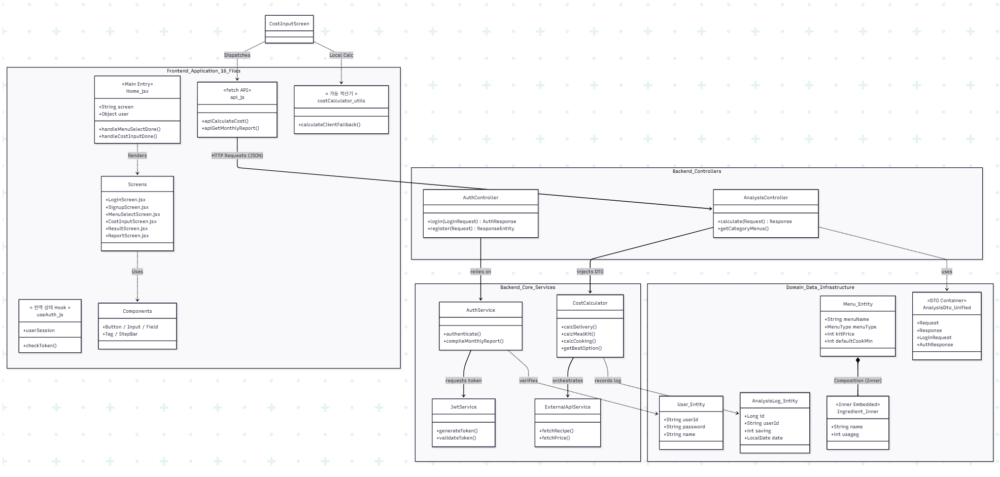
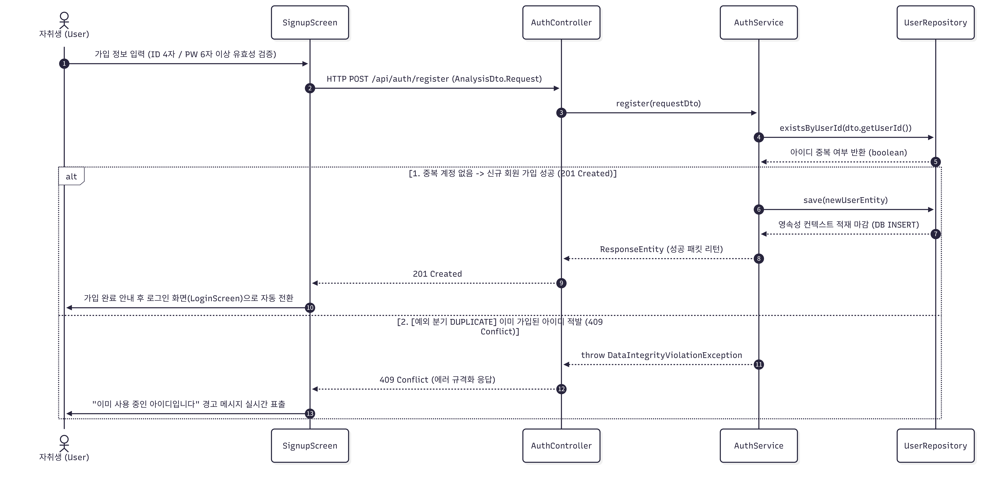
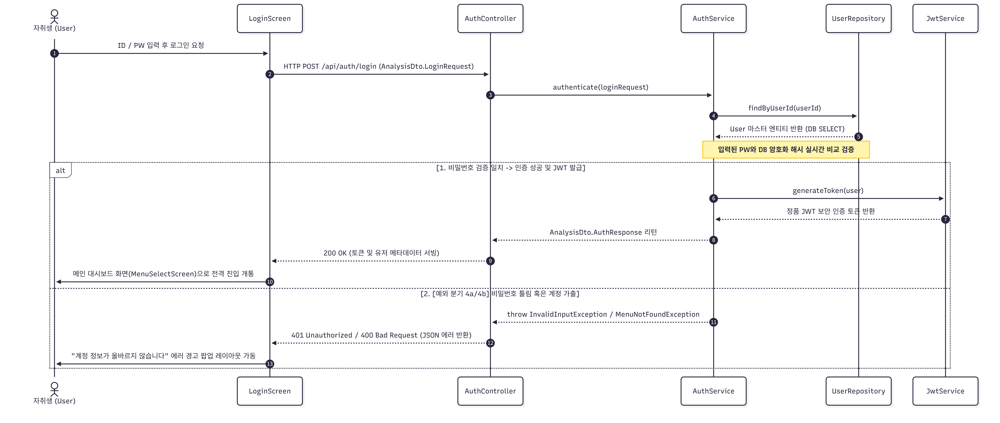
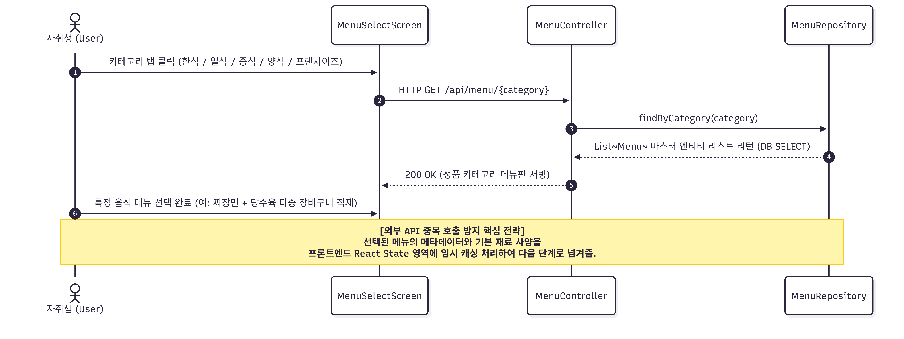
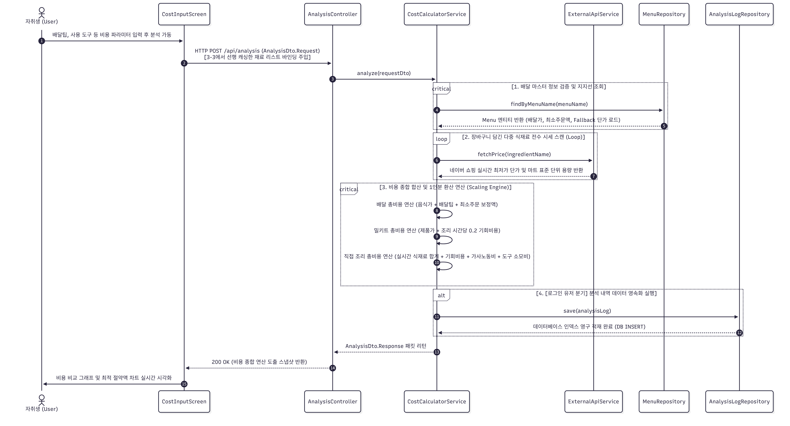
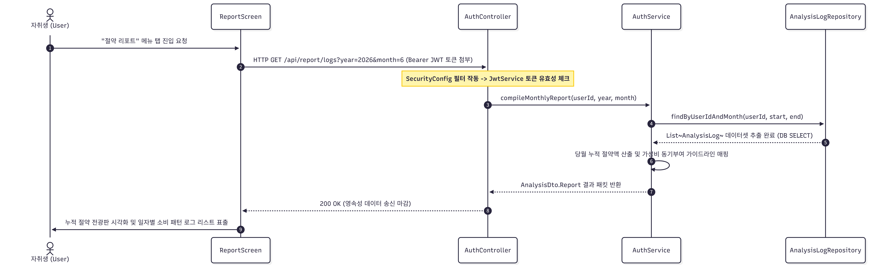
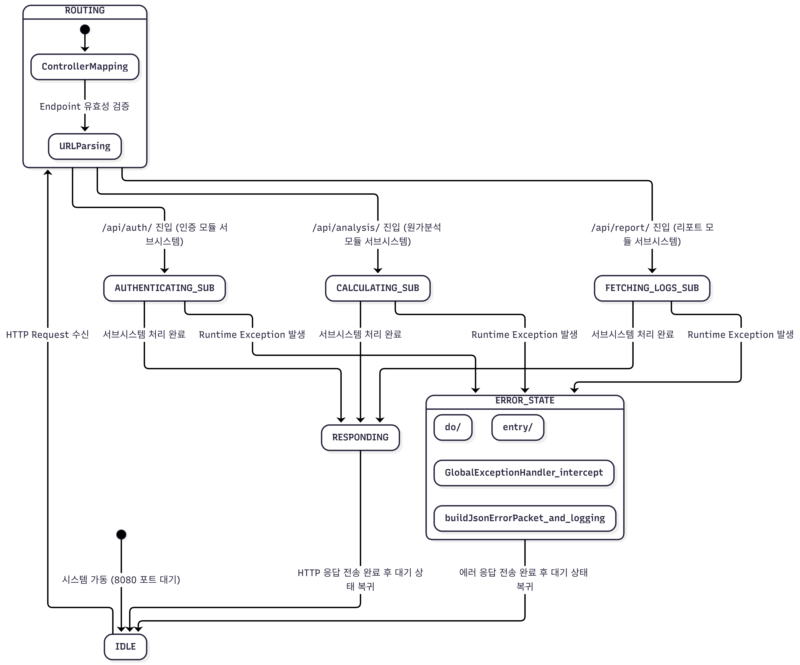
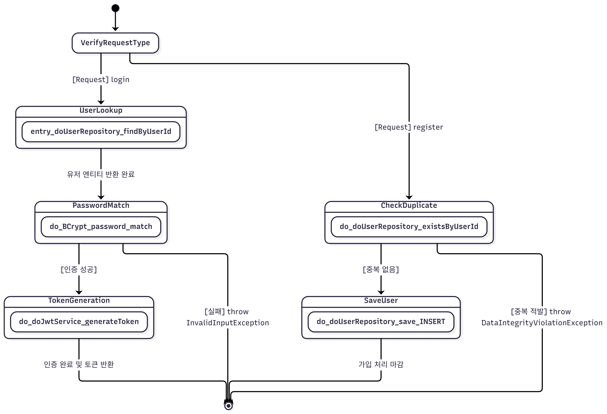
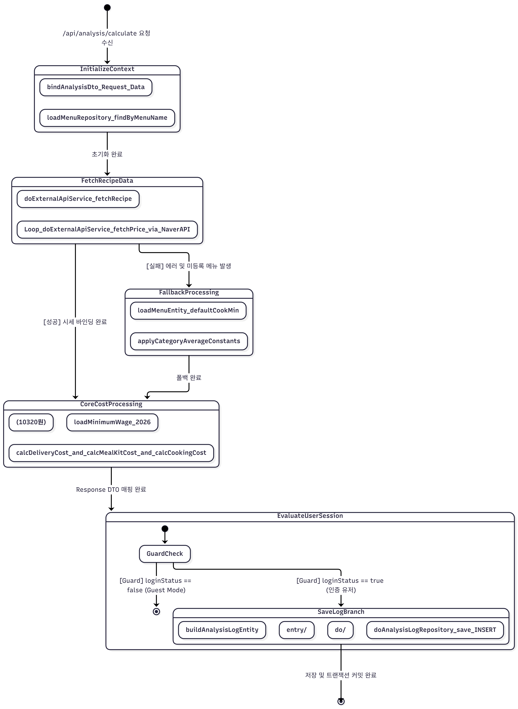
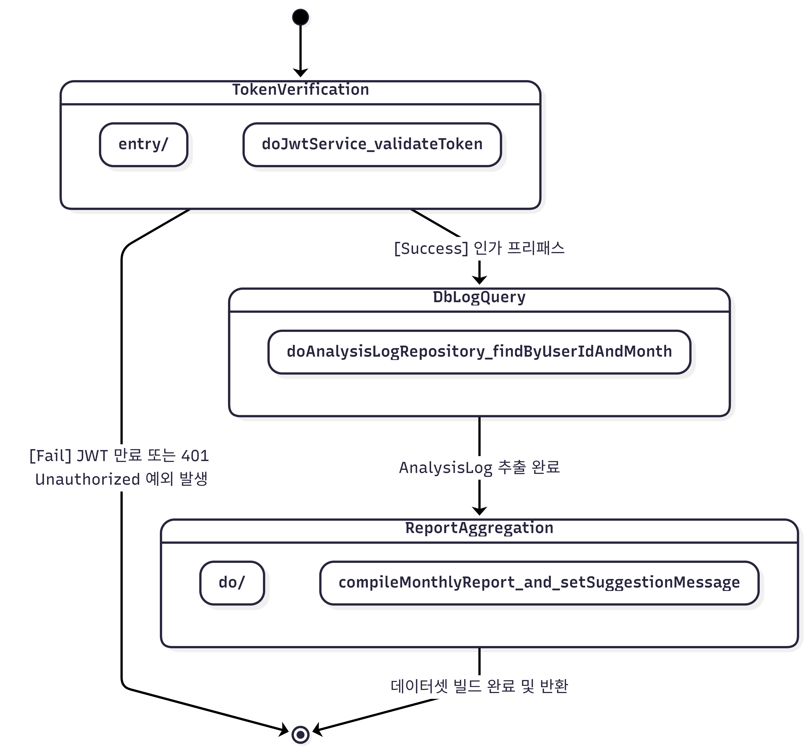

# H.O.M.E — Design Report

> **Hidden Opportunity Meal Economics**
> 배달 · 밀키트 · 직접 조리 비용을 비교 분석하는 웹

---

| | |
|---|---|
| **Student No** | 22212042 |
| **Name** | 김민범 |
| **E-Mail** | 7557191@naver.com |

---

## Revision History

| Revision date | Version | Description | Author |
|---|---|---|---|
| 2026-05-19 | 1.00 | 초기 버전 | 김민범 |
| 2026-05-22 | 1.01 | Class Diagram 서버 계층 추가, Sequence Diagram 백엔드 흐름 보완, State Machine 서버 상태 추가 | 김민범 |
| 2026-06-04 | 1.02 | IngredientMapper 위치 수정(RecipeService 내부 유틸), CostCalculatorService → ShoppingService 직접 호출 구조로 변경, Sequence Diagram 외부 API 중복 호출 제거(DTO 바인딩 방식 채택), 서버 State Machine Guest Mode 분기 추가, VirtualMartDB 정규화 방어 문구 추가 | 김민범 |

---

## Contents

1. [Introduction](#1-introduction)
2. [Class Diagram](#2-class-diagram)
3. [Sequence Diagram](#3-sequence-diagram)
4. [State Machine Diagram](#4-state-machine-diagram)
5. [Implementation Requirements](#5-implementation-requirements)
6. [Glossary](#6-glossary)
7. [References](#7-references)

---

## 1. Introduction

현대인의 식생활에서 배달 앱 사용이 일상화되면서 식비 지출이 증가하고 있다. 많은 사람들이 배달 음식의 편의성에 의존하면서도, 실제로 직접 조리하거나 밀키트를 활용했을 때와의 비용 차이를 인식하지 못하는 경우가 많다.

**H.O.M.E(Hidden Opportunity Meal Economics)** 는 이러한 문제를 해결하기 위해 개발된 웹 기반 식사 비용 비교 분석 서비스다. 사용자가 원하는 메뉴를 선택하면 배달, 밀키트, 직접 조리 세 가지 방식의 총비용을 자동으로 계산하고 비교하여 최적의 선택을 안내한다.

비용 계산 시 단순한 음식 가격뿐만 아니라 배달팁, 최소주문금액 보정, 조리 시간에 따른 기회비용, 가사노동비, 도구 비용 등 숨겨진 비용(Hidden Opportunity Cost)까지 포함하여 실질적인 비용을 산출한다.

본 서비스의 주요 목표는 다음과 같다.

- **투명한 비용 비교**: 세 가지 식사 방식의 실질 비용을 항목별로 명확하게 제시
- **절약액 시각화**: 배달 대비 절약 가능한 금액을 직관적으로 표현
- **누적 리포트 제공**: 분석 내역을 저장하여 월별 절약액을 추적

본 문서는 H.O.M.E 시스템 개발의 Design 단계에 해당하며, 실제 구현에 직접적으로 관여하는 모든 요소들의 윤곽을 확정하고 구체적으로 디자인한 내용을 다룬다. 특히 프론트엔드 컴포넌트 구조뿐만 아니라 **백엔드 Controller → Service → Repository 계층 구조**, **DTO와 Entity의 분리**, **서버 상태 머신**까지 포함하여 전체 시스템 아키텍처를 설계한다.

---

## 2. Class Diagram

H.O.M.E 시스템의 클래스는 **프론트엔드 레이어**, **백엔드 서비스 레이어**, **데이터 레이어** 세 계층으로 구분된다.

---

### 2-1. 전체 클래스 관계도

> **ExternalApiService 내부 정규화 원칙:**
> `ExternalApiService`는 농촌진흥청 API 응답의 원본 재료명을 네이버 쇼핑 검색어로 정규화하는 단일 가공 책임을 가진다. 정규화된 `Ingredient` 객체 리스트는 외부 API 연동 성공 시 반환되며, `CostCalculatorService`가 이 리스트를 순회하며 `ShoppingService.fetchPrice()`를 재료별로 독립적으로 호출하여 가격 데이터를 채워 넣는다.

---

### 2-2. 클래스 관계 다중성 (Multiplicity)

| 관계 | 클래스 A | 다중성 | 클래스 B | 관계 유형 |
|------|----------|--------|----------|-----------|
| 사용자는 여러 분석 로그를 가진다 | User | 1 ──── * | AnalysisLog | Association |
| 메뉴 엔티티는 내부 재료 클래스를 포함한다 | Menu | 1 ──── * | Menu.Ingredient | Composition |
| 분석 컨트롤러는 계산 서비스를 소환한다 | AnalysisController | 1 ──── 1 | CostCalculatorService | Dependency |
| 계산 서비스는 외부 연동 서비스를 주입받는다 | CostCalculatorService | 1 ──── 1 | ExternalApiService | Dependency |
| 인증 서비스는 토큰 보안 서비스를 가동한다 | AuthService | 1 ──── 1 | JwtService | Dependency |
| 각 서비스 계층은 해당 레포지토리를 호출한다 | Service Layer | 1 ──── 1 | Repository Layer | Dependency |

---

### 2-3. DTO vs Entity 분리 명세

시스템의 결합도를 낮추고 데이터 영속성 계층을 보호하기 위해, 영속 데이터 모델(Entity)과 네트워크 전송 객체(DTO)를 엄격히 분리하였다. 특히 DTO 계층은 파일 분리를 최소화하고 유지보수 생산성을 극대화하기 위해 `AnalysisDto` 컨테이너 내부 이너 클래스 구조를 전격 채택하였다.

| 구분 | 클래스명 | 위치 | 설명 |
|------|----------|------|------|
| Entity | `User` | `domain/User.java` | 사용자 계정 마스터 정보 DB 테이블 매핑 (JPA `@Entity`) |
| Entity | `Menu` | `domain/Menu.java` | 대표 배달 메뉴 정보 및 인메모리 가격 DB 테이블 매핑 |
| Entity | `AnalysisLog` | `domain/AnalysisLog.java` | 사용자의 기회비용 비교 분석 결과 로그 데이터 DB 매핑 |
| Inner Class | `Menu.Ingredient` | `domain/Menu.java` | Menu 엔티티 내부에서 사용되는 식재료 메타데이터 모델 |
| DTO (Inner) | `AnalysisDto.Request` | `dto/AnalysisDto.java` | 프론트 → 백엔드 비용 분석 요청 객체 (캐싱 재료 리스트 포함) |
| DTO (Inner) | `AnalysisDto.Response` | `dto/AnalysisDto.java` | 백엔드 → 프론트 최종 비용 비교 연산 결과 반환 데이터 객체 |
| DTO (Inner) | `AnalysisDto.LoginRequest` | `dto/AnalysisDto.java` | 로그인 인증 처리용 계정 검증 데이터 객체 |
| DTO (Inner) | `AnalysisDto.AuthResponse` | `dto/AnalysisDto.java` | JWT 인증 성공 시 발급 토큰 및 세션 정보 반환 객체 |

---

### 2-4. VirtualMartDB 설계 개요

`VirtualMartDB`는 배달의민족 앱 기준으로 수동 수집한 **In-memory Mock Database**이다. 프로토타입 개발 단계의 민첩성과 가용성을 위해 `Menu` 엔티티의 필드로 병합 관리된다. 애플리케이션 가동 시 `DataInitializer.java`에서 초기 데이터셋이 가상 데이터베이스 엔진으로 자동 주입(INSERT)된다.

---

### 2-5. 클래스 상세 설명표 (백엔드 기준 19개)

| Class Name | Layer | Explanation |
|------------|-------|-------------|
| `User` | Entity | 사용자 정보를 관리하는 JPA 엔티티. `userId`, `password`, `name`을 포함한다. |
| `Menu` | Entity | 메뉴 마스터 정보와 VirtualMartDB 역할을 통합한 JPA 엔티티. 내부에 `Ingredient` 클래스를 포함한다. |
| `AnalysisLog` | Entity | 사용자의 배달 대비 절약 금액 및 세 옵션 총비용 분석 결과를 기록하는 JPA 엔티티. |
| `MenuType` | Enum | 메뉴별 조리 가용 형태를 분류하는 열거형 속성 (`ALL` / `NO_COOKING` / `DELIVERY_ONLY`). |
| `AnalysisDto` | DTO | 이너 클래스 패턴을 채택하여 `Request`, `Response` 등 계층 간 데이터 전송 객체 구조를 단일 파일로 통합 관리한다. |
| `UserRepository` | Repository | `User` 엔티티에 대한 영속성 처리 및 아이디 중복 검증(`existsByUserId`)을 담당하는 JPA 인터페이스. |
| `MenuRepository` | Repository | `Menu` 엔티티에 대한 영속성 처리 및 카테고리별 필터링 조회를 전담하는 JPA 인터페이스. |
| `AnalysisLogRepository` | Repository | `AnalysisLog` 엔티티에 대한 데이터베이스 CRUD 및 월간 로그 집계 쿼리 인터페이스. |
| `AuthService` | Service | 사용자 로그인 인증 및 회원가입 검증 비즈니스 로직을 총괄한다. |
| `JwtService` | Service | 시스템 보안 강화를 위해 JWT(JSON Web Token)의 발급 및 파싱, 인가 유효성 검증을 전담한다. |
| `ExternalApiService` | Service | 농촌진흥청 레시피 API 및 네이버 쇼핑 최저가 검색 API를 통합 호출하여 데이터 정규화를 수행한다. |
| `CostCalculatorService` | Service | H.O.M.E의 핵심 수학적 연산 엔진. 배달 총비용, 밀키트 1인분 환산가, 조리 기회비용 및 **월간 리포트 통계 집계 데이터 연산 생성**을 담당한다. |
| `AuthController` | Controller | 유저 로그인 및 회원가입 요청 HTTP 엔드포인트를 매핑한다. |
| `AnalysisController` | Controller | 프론트엔드 장바구니 파이프라인과 결합하여 세 옵션 기회비용 비교 연산 및 **월간 가성비 통계 리포트 조회** HTTP API를 통합 처리한다. |
| `MenuController` | Controller | 카테고리별 전체 배달 메뉴 목록을 DB에서 조회하여 프론트엔드로 서빙하는 HTTP 엔드포인트를 처리한다. |
| `GlobalExceptionHandler` | Exception | 시스템 런타임 중 발생하는 예외(`InvalidInput`, `MenuNotFound` 등)를 가로채 규격화된 JSON으로 통합 반환한다. |
| `SecurityConfig` | Config | JWT 인증 필터 체인 연동 및 인가 권한, 스프링 시큐리티 인프라를 설계한다. |
| `AppConfig` | Config | 교차 출처 자원 공유(CORS) 전면 허용 정책 설정 및 외부 API 비동기 통신을 위한 `WebClient` 인프라를 정의한다. |
| `DataInitializer` | Config | 애플리케이션 구동 시점에 VirtualMartDB의 메뉴 시세 데이터를 자동 삽입(JPA 영속화)한다. |

---

## 3. Sequence Diagram

H.O.M.E 시스템의 주요 기능 흐름을 실전 Spring Boot 3계층(Controller → Service → Repository)과 객체 영속화 생명 주기에 맞추어 순차적으로 기술한다. 특히 핵심 기능인 비용 분석 연산은 외부 open API의 중복 호출을 차단하기 위해 프론트엔드 캐싱 전략을 유기적으로 결합하여 설계하였다.

---

### 3-1. 회원가입 및 초기 영속화 흐름
* **연결 유스케이스:** (시스템 내부 인프라 기능으로 유스케이스 목록 외에 해당)

---

### 3-2. 로그인 및 세션 인증 흐름
* **연결 유스케이스:** `UC-01 (사용자 로그인 및 토큰 인가)`

> **비로그인(Guest) 시작 시:** `/api/auth` 호출 없이 프론트엔드에서 guest 상태로 전환한다. 분석 데이터는 브라우저 메모리에 임시 저장된다.

---

### 3-3. 메뉴 선택 및 레시피 선행 캐싱 흐름
* **연결 유스케이스:** `UC-02 (카테고리별 배달 메뉴판 조회)`, `UC-05 (분석 대상 다중 메뉴 장바구니 선택)`

> **설계 의도:** 외부 API(농촌진흥청, 네이버 쇼핑)의 중복 호출을 방지하기 위해, 메뉴 선택 단계에서 레시피 메타데이터를 선행 조회하여 프론트엔드 State에 캐싱한다. 이후 비용 분석 요청 시 해당 데이터를 AnalysisRequestDto에 바인딩하여 전송하므로, 백엔드에서는 외부 API 재호출 없이 계산 로직만 수행한다.

---

### 3-4. 비용 분석 및 기회비용 종합 산출 흐름 (핵심 기능)
* **연결 유스케이스:** `UC-03 (기회비용 변수 입력)`, `UC-04 (3대 식사 옵션 총비용 산출 연산)`, `UC-06~09 (배달/밀키트/조리 단가 매핑 및 결과 시각화)`

**API 실패 시 Fallback 처리:**

| API | 실패 조건 | Fallback |
|:---|:---|:---|
| 농촌진흥청 레시피 API (3-3 단계) | HTTP 오류 / 미등록 메뉴 | Menu 엔티티의 `defaultCookMin` 사용. 재료 목록은 사용자 직접 입력 요청. |
| 네이버 쇼핑 API (3-4 단계) | HTTP 오류 / 검색 결과 없음 | 세션 캐시 → Menu 엔티티의 `ingredientCost` 기본값 사용. |

---

### 3-5. 누적 리포트 및 절약 로그 조회 흐름
* **연결 유스케이스:** `UC-11 (월간 누적 분석 로그 영속화 저장)`, `UC-12 (월별 절약액 리포트 시각화 출력)`

> **비로그인(Guest) 흐름:** `POST /api/analysis/calculate` 호출 후 결과 노출 완료 시 `POST /api/analysis/logs` 호출 없이 프론트엔드 메모리에 임시 저장. 새로고침 시 초기화된다.

---

## 4. State Machine Diagram

H.O.M.E 시스템의 상태 머신을 클라이언트(프론트엔드 컴포넌트 화면 전환 및 캐싱)와 서버(백엔드 도메인 라우팅) 두 관점으로 분리하여 표현한다.

---

### 4-1. 클라이언트 State Machine

> **클라이언트 상태 제어 명세 (관심사 분리):**
> 본 상태도는 앱 전체의 단순 시나리오 나열을 배제하고, H.O.M.E의 핵심 UX 정체성인 **'MenuSelectScreen에서 CostInputScreen으로 이어지는 프론트엔드 데이터 캐싱 파이프라인'**의 내부 상태 전이를 명세한다. 유저가 메뉴를 선택했을 때 비동기로 외부 API 레시피를 선행 조회하여 리액트 콘텍스트 변수(`ingredientList`)에 캐싱 적재하는 생명주기와, 비용 입력 폼의 유효성 검증(`FORM_VALIDATED`)이 완료되어 최종 분석 DTO 바인딩으로 이어지는 프론트엔드 컴포넌트의 실시간 행위를 제어한다.

---

### 4-2. 서버 State Machine

> **Guest Mode 분기 설명:**
> 사용자가 비로그인(Guest) 상태로 분석을 요청한 경우, 서버는 비용 계산(CALCULATING) 후 `SAVING_LOG` 상태를 건너뛰고 바로 `RESPONDING` 상태로 전이한다. 분석 결과 데이터는 프론트엔드 메모리에만 임시 저장된다.

#### 4-2-1. 사용자 인증 상태도 (AUTHENTICATING_SUB)

#### 4-2-2. 원가분석 상태도 (CALCULATING_SUB)

#### 4-2-3. 리포트 분석 상태도 (FETCHING_LOGS_SUB)

---

### 4-3. State 설명표

**클라이언트 상태:**

| State | Explanation |
|---|---|
| **LAUNCH_SYSTEM** | 시스템이 실행된 상태. 로그인 화면이 표시된다. |
| **LOGIN** | POST /api/auth/login 응답을 기다리는 상태. 성공 시 MENU_SELECT, 실패 시 오류 메시지 후 재입력 대기. |
| **SIGNUP** | POST /api/auth/signup 요청 및 응답 대기 상태. 클라이언트 유효성 검사 후 서버 요청. 성공 시 자동 로그인. |
| **GUEST_MODE** | 비로그인 상태. 모든 분석 기능 사용 가능하나 데이터는 브라우저 메모리에 임시 저장. |
| **MENU_SELECT** | 카테고리와 메뉴를 선택하는 상태. 메뉴 선택 시 레시피 API를 선행 호출하여 프론트 State에 캐싱한다. |
| **COST_INPUT** | 배달팁, 밀키트 가격, 조리 시간, 사용 도구 등 비용 정보를 입력하는 상태. |
| **LOADING** | POST /api/analysis/calculate 요청 후 응답 대기 상태. |
| **RESULT_VIEW** | 계산 결과를 바 차트로 시각화하고 최적 옵션과 절약액을 표시하는 상태. |
| **SAVING_LOG** | 분석 결과를 POST /api/analysis/logs로 저장하는 상태. 비로그인 시 프론트엔드 메모리에만 저장. |
| **REPORT_VIEW** | 저장된 분석 내역과 이번 달 총 절약액을 표시하는 상태. |
| **ERROR** | API 오류 발생 시 오류 메시지와 재시도 옵션을 제공하는 상태. |

**서버 상태:**

| State | Explanation |
|---|---|
| **IDLE** | HTTP 요청을 대기하는 상태. |
| **ROUTING** | HTTP 요청이 수신되어 Controller가 라우팅을 결정하는 상태. |
| **AUTHENTICATING** | AuthService가 UserRepository를 통해 사용자 인증을 처리하는 상태. |
| **CALCULATING** | CostCalculatorService가 ShoppingService를 재료별로 반복 호출하여 단가를 채운 뒤, 세 옵션의 총비용을 계산하는 상태. |
| **SAVING_LOG** | AnalysisLogRepository를 통해 분석 결과를 DB에 저장하는 상태. **로그인 유저에 한해 진입**하며, Guest Mode 시 건너뛴다. |
| **FETCHING_LOGS** | AnalysisLogRepository를 통해 월간 로그를 DB에서 조회하는 상태. |
| **RESPONDING** | 처리 결과를 JSON으로 직렬화하여 HTTP 응답을 전송하는 상태. |
| **ERROR_STATE** | 처리 중 예외 발생 시 오류를 로깅하고 4xx/5xx 응답을 반환하는 상태. |

---

## 5. Implementation Requirements

### 5-1. Hardware Requirements

| 항목 | 요구사항 |
|---|---|
| CPU | Intel Core i3 이상 |
| RAM | 4GB 이상 |
| Storage | 1GB 이상의 여유공간 |
| Network | 인터넷 연결 필요 (농촌진흥청 API, 네이버 쇼핑 API 연동 시) |

### 5-2. Software Requirements

**Frontend**

| 항목 | 요구사항 스펙 명세 |
|---|---|
| Node.js | v18 이상 |
| React | v18 이상 |
| Vite | v5 이상 |
| CSS 아키텍처 | React 내장 인라인 스타일 정책 (Inline Style Components) 채택 |
| 브라우저 | Chrome 90+, Firefox 88+, Safari 14+ |

**Backend**

| 항목 | 버전 |
|---|---|
| Java | JDK 17 이상 |
| Spring Boot | v3.x 이상 |
| Build Tool | Gradle 또는 Maven |
| Database | H2 (개발 환경) / MySQL (운영 환경) |
| ORM | Spring Data JPA |

### 5-3. External API Requirements

| API | 용도 | Fallback |
|---|---|---|
| 농촌진흥청 레시피 API | 메뉴별 조리 시간 및 재료 조회 (3-3 단계 선행 호출) | Menu 엔티티의 `defaultCookMin`, `ingredientCost` |
| 네이버 쇼핑 API | 식재료 단위 가격 조회 (3-4 단계 재료별 호출) | 세션 캐시 → Menu 엔티티 기본값 |
| VirtualMartDB (In-memory) | 배달 가격 및 최소주문금액 | Menu 엔티티 하드코딩 값 |

### 5-4. Nonfunctional Requirements

| 항목 | 요구사항 |
|---|---|
| **보안** | 비밀번호 평문 저장 금지. 운영 환경에서 BCrypt 암호화 필수. JWT 기반 인증 적용. |
| **성능** | 비용 계산 API 응답 시간 2초 이내. 외부 API 타임아웃 3초 후 Fallback 자동 전환. |
| **동시성 (Concurrency)** | Spring Boot 내장 Tomcat의 멀티스레드 처리로 동시 요청 지원. 외부 API 호출은 타임아웃 설정으로 스레드 점유 방지. |
| **반응형** | 모바일(320px) ~ 데스크탑(1920px) 전 환경 지원. Flexbox 및 인라인 반응형 퍼센트 기반 비율 제어. |
| **접근성** | 비로그인(Guest) 상태에서도 모든 분석 기능 사용 가능. |
| **캐싱 (Caching)** | 메뉴 선택 단계(3-3)에서 획득한 레시피 메타데이터를 프론트엔드 State에 캐싱하여, 비용 분석 요청(3-4) 시 농촌진흥청 API 중복 호출을 방지한다. 네이버 쇼핑 API 응답은 세션 내 캐싱하여 동일 재료 중복 조회를 차단한다. |
| **오류 처리** | 외부 API 오류, DB 오류, 유효성 검사 오류를 각각 구분하여 사용자에게 명확한 메시지 제공. |
| **데이터 정합성** | AnalysisLog 저장 시 트랜잭션 적용(`@Transactional`). 저장 실패 시 rollback. |

---

## 6. Glossary

| 용어 | 설명 |
|---|---|
| **기회비용 (Opportunity Cost)** | 조리 시간 동안 다른 활동을 하지 못함으로써 발생하는 비용. `조리시간(h) × 0.2 × 최저임금`으로 계산한다. 계수 0.2는 조리 중 병행 활동이 가능함을 반영한 값이다. |
| **가사노동비** | 설거지 등 조리 후 정리 시간에 대한 비용. `설거지시간(h) × 최저임금`으로 계산한다. |
| **최저임금** | 2026년 기준 시간당 10,320원으로 고정. 사용자가 직접 수정 가능. |
| **MenuType** | 메뉴의 구매 가능 방식을 나타내는 열거형. `ALL` / `NO_COOKING` / `DELIVERY_ONLY`. |
| **VirtualMartDB** | 배달의민족 앱 기반으로 수동 수집한 In-memory Mock Database. 프로토타입 단계에서 Menu 엔티티로 통합 관리하며, 고도화 단계에서 별도 테이블로 분리 예정. |
| **Fallback** | 외부 API 호출이 실패했을 때 미리 정의된 기본값으로 대체하는 처리 방식. |
| **Guest Mode** | 로그인 없이 서비스를 이용하는 상태. 분석 데이터는 브라우저 메모리에 임시 저장. 서버의 SAVING_LOG 상태를 건너뛴다. |
| **DTO (Data Transfer Object)** | 계층 간 데이터 전달을 위한 객체. DB에 저장되지 않는다. `Ingredient`, `AnalysisRequestDto`, `AnalysisResponseDto`가 해당된다. |
| **Entity** | JPA를 통해 DB 테이블과 매핑되는 클래스. `User`, `Menu`, `AnalysisLog`가 해당된다. |
| **IngredientMapper** | ExternalApiService 내부에서 데이터 단가 파싱 및 매핑 작업을 전담하는 고유 정규화 규칙 로직 명세. |
| **Controller → Service → Repository** | Spring Boot의 3계층 아키텍처. Controller는 HTTP 요청 처리, Service는 비즈니스 로직, Repository는 DB 접근을 담당한다. |
| **@Transactional** | Spring의 트랜잭션 어노테이션. 메서드 실행 중 오류 발생 시 DB 작업을 rollback한다. |
| **AnalysisRequestDto** | 프론트엔드가 비용 분석 요청 시 전송하는 DTO. 3-3 단계에서 캐싱한 재료 목록(ingredientList)을 포함하여 농촌진흥청 API 중복 호출을 방지한다. |

---

## 7. References

- 농촌진흥청 농식품 올바로 API: https://www.nongsaro.go.kr/portal/ps/psb/psbk/kidofcomdtyList.ps
- 네이버 쇼핑 검색 API: https://developers.naver.com/docs/serviceapi/search/shopping/shopping.md
- React 공식 문서: https://react.dev
- Spring Boot 공식 문서: https://spring.io/projects/spring-boot
- Spring Data JPA 공식 문서: https://spring.io/projects/spring-data-jpa
- Tailwind CSS 공식 문서: https://tailwindcss.com
- 최저임금위원회 (2026년 최저임금 기준): https://www.minimumwage.go.kr
